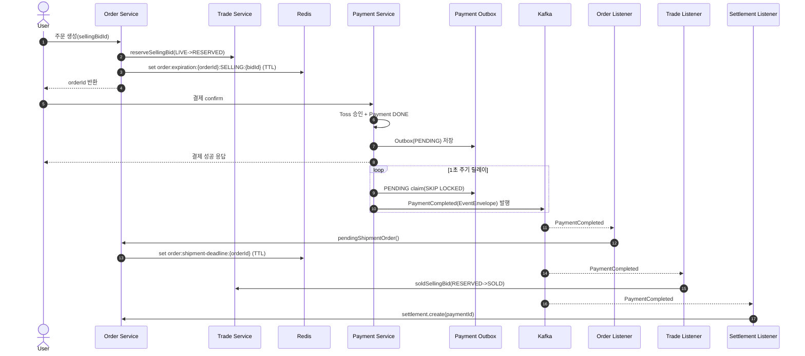
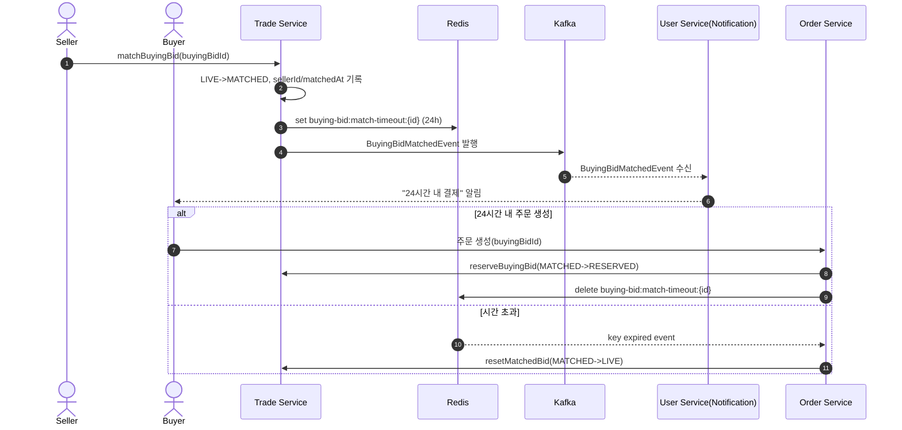
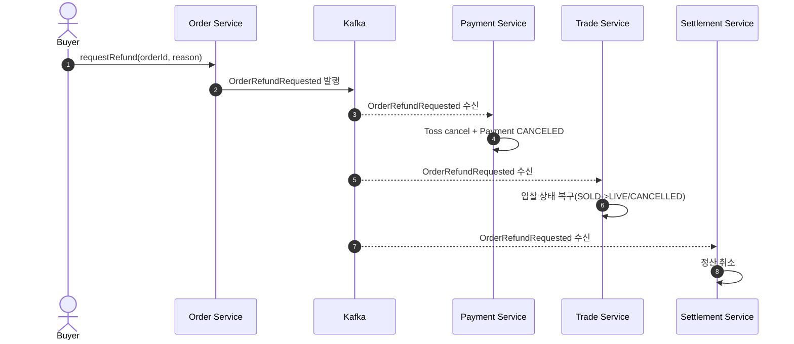
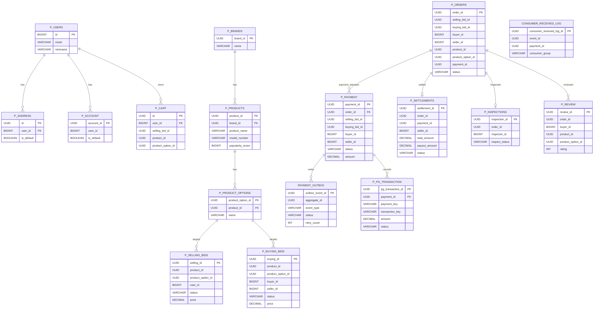

# 📦 Unbox Workspace (MSA E-commerce Platform)

> Unbox는 한정판 거래 플랫폼(KREAM, StockX 스타일)을 모티브로 한 MSA 기반 이커머스 시스템입니다.
> 로컬에서의 가이드뿐만 아니라, 서비스별 책임/통신/데이터/패턴/운영 관점까지 한 번에 이해할 수 있도록 작성되었습니다.

**Last Updated:** 2026-02-17

---

## 1. 문서 범위

이 README는 다음과 같이 이루어져 있습니다.

- 로컬 환경 실행부터 서비스별 Swagger 접근
- Dev URL 접근 규칙 및 관측 대시보드 URL
- 서비스별 기능과 공개/내부 API 역할
- Redis 키 설계, Kafka 이벤트 설계, 동기/비동기 경계
- Spring Boot 기능이 각 서비스에서 쓰이는 방식
- 적용된 디자인 패턴과 트레이드오프
- 핵심 시퀀스 다이어그램, ERD(핵심 도메인)

---

## 2. 빠른 시작 (Local)

### 2.1 사전 준비

- Docker, Docker Compose
- Java 17 (코드 수정/서비스 로컬 실행 시)

### 2.2 필수 환경 변수 (.env)

프로젝트 루트에 `.env` 파일을 만들고 최소 아래 값들을 지정하세요.

```env
DB_USERNAME=postgres
DB_PASSWORD=postgres
SPRING_JWT_SECRET=your_jwt_secret

# Payment
TOSS_SECRET_KEY=...
TOSS_SECURITY_KEY=...

# Product AI
OPENAI_API_KEY=...
OPENAI_MODEL=gpt-4o-mini
OPENAI_BASE_URL=https://api.openai.com/v1

# Optional (알림)
MAIL_USERNAME=...
MAIL_PASSWORD=...
MAIL_FROM=noreply@unbox.com
```

### 2.3 실행

```bash
docker-compose up -d --build
```

### 2.4 기본 확인

- `docker ps` 로 컨테이너 상태 확인
- Swagger 접속 확인: `http://localhost:8081/user/swagger-ui/index.html`

---

## 3. 접속 URL

### 3.1 서비스 URL (Local / Dev)

> 각 서비스는 `server.servlet.context-path`를 사용합니다. (`/user`, `/product`, `/trade`, `/order`, `/payment`)

| 서비스  | Local Base                      | Local Swagger                                         | Dev Base                           | Dev Swagger                                              |
| :------ | :------------------------------ | :---------------------------------------------------- | :--------------------------------- | :------------------------------------------------------- |
| User    | `http://localhost:8081/user`    | `http://localhost:8081/user/swagger-ui/index.html`    | `https://dev.un-box.click/user`    | `https://dev.un-box.click/user/swagger-ui/index.html`    |
| Product | `http://localhost:8082/product` | `http://localhost:8082/product/swagger-ui/index.html` | `https://dev.un-box.click/product` | `https://dev.un-box.click/product/swagger-ui/index.html` |
| Trade   | `http://localhost:8083/trade`   | `http://localhost:8083/trade/swagger-ui/index.html`   | `https://dev.un-box.click/trade`   | `https://dev.un-box.click/trade/swagger-ui/index.html`   |
| Order   | `http://localhost:8084/order`   | `http://localhost:8084/order/swagger-ui/index.html`   | `https://dev.un-box.click/order`   | `https://dev.un-box.click/order/swagger-ui/index.html`   |
| Payment | `http://localhost:8085/payment` | `http://localhost:8085/payment/swagger-ui/index.html` | `https://dev.un-box.click/payment` | `https://dev.un-box.click/payment/swagger-ui/index.html` |

### 3.2 관측/운영 URL

| 도구       | Local                   | Dev                                 |
| :--------- | :---------------------- | :---------------------------------- |
| Grafana    | `http://localhost:3000` | `https://grafana.dev.un-box.click/` |
| Prometheus | `http://localhost:9090` | 내부 운영 접근 정책에 따름          |
| Kafka UI   | `http://localhost:8090` | 내부 운영 접근 정책에 따름          |
| Loki API   | `http://localhost:3100` | 내부 운영 접근 정책에 따름          |
| Tempo API  | `http://localhost:3200` | 내부 운영 접근 정책에 따름          |

참고:

- 로컬 Grafana는 `GF_AUTH_ANONYMOUS_ENABLED=true` 로 Viewer 접근 가능
- 로컬 관리자 계정은 `admin/admin`

---

## 4. 아키텍처 개요

### 4.1 서비스 구성

| 서비스  | 모듈            | 포트 | Context Path | 핵심 책임                                                         |
| :------ | :-------------- | :--- | :----------- | :---------------------------------------------------------------- |
| Common  | `unbox_common`  | -    | -            | 공통 DTO/이벤트, JWT, 에러, Redis/Kafka 설정, 분산락 AOP          |
| User    | `unbox_user`    | 8081 | `/user`      | 회원/관리자 인증, 프로필, 주소/정산계좌, 장바구니, 상품요청, 알림 |
| Product | `unbox_product` | 8082 | `/product`   | 브랜드/상품/옵션/리뷰, AI 리뷰 요약, 상품 조회 캐시               |
| Trade   | `unbox_trade`   | 8083 | `/trade`     | 판매입찰/구매입찰, 매칭, 가격 이벤트, 동시성 전략                 |
| Order   | `unbox_order`   | 8084 | `/order`     | 주문 생성/상태 전이, 검수, 배송 타임아웃, 정산 도메인             |
| Payment | `unbox_payment` | 8085 | `/payment`   | 결제 준비/승인/환불, PG 연동, Outbox 기반 이벤트 발행             |

### 4.2 인프라 구성 (docker-compose)

- PostgreSQL (단일 인스턴스, 서비스별 DB 분리)
- Redis (캐시 + 락 + 타임아웃 키)
- Kafka (KRaft mode) + Kafka UI
- Observability: Prometheus + Loki + Tempo + Grafana (+ Fluent-bit)

### 4.3 데이터 전략

- Database-per-Service (논리 분리)
  - `unbox_user`, `unbox_product`, `unbox_trade`, `unbox_order`, `unbox_payment`
- 엔티티 공통 기반
  - `BaseEntity` + `@SQLRestriction("deleted_at IS NULL")` 기반 Soft Delete
- Auditing
  - `created_at`, `updated_at`, `deleted_at` + `created_by/updated_by/deleted_by`

### 4.4 통신 전략

- 동기(Sync): OpenFeign
  - 즉시 검증/선점/조회가 필요한 경로
- 비동기(Async): Kafka + EventEnvelope
  - 서비스 간 상태 전파, 후속 처리, 느슨한 결합

---

## 5. 서비스별 상세

## 5.1 User Service (`unbox_user`)

### 역할

- 사용자/관리자 인증(JWT)
- 사용자 프로필 관리
- 배송지/정산 계좌 관리
- 장바구니
- 상품 요청(Product Request)
- 거래 이벤트(매칭) 기반 메일 알림 발송

### 공개 API 그룹

- 인증: `/api/auth/*`, `/api/admin/auth/*`
- 사용자: `/api/users/me`
- 관리자 유저/스태프: `/api/admin/users`, `/api/admin/staff`
- 주소: `/users/me/addresses`
- 계좌: `/users/me/accounts`
- 장바구니: `/api/carts`
- 상품요청: `/api/products/requests`, `/api/admin/product-requests`

### 내부 API 그룹

- `/internal/users/{userId}/for-selling-bid`
- `/internal/users/{userId}/for-order`
- `/internal/users/{userId}/has-default-account`

### Redis 사용

- Refresh Token 저장: `refresh:{email}` (TTL 60시간)
- Access Token 블랙리스트: `blacklist:{token}` (토큰 잔여 만료시간)

### Kafka 사용

- Consumer: `trade-events`
  - `BuyingBidMatchedEvent` 수신 후 알림 발송

### Spring Boot

- Spring Security (Stateless + JWT Filter)
- Custom Login/Logout Filter
- `@EnableAsync` (비동기 작업 기반)
- OpenFeign

---

## 5.2 Product Service (`unbox_product`)

### 역할

- 브랜드/상품/옵션 관리
- 상품 조회/상세/옵션/리뷰
- AI 리뷰 요약
- Trade 가격 이벤트 반영 캐시 업데이트
- 상품 삭제 이벤트 발행(Trade 정리 트리거)

### 공개 API 그룹

- 상품 조회: `/api/products`, `/api/products/{id}`, `/api/products/{id}/options`, `/api/products/brands`
- 리뷰: `/api/reviews`
- AI: `/api/ai/reviews/summary/{productId}`
- 관리자: `/api/admin/brands`, `/api/admin/products`, `/api/admin/products/{productId}/options`

### 내부 API 그룹

- `/internal/products/options/{id}/for-order`
- `/internal/products/options/{id}/for-selling-bid`
- `/internal/products/options/{id}/for-buying-bid`
- `/internal/reviews/products/{productId}`

### Redis 사용

- `product:info:{productId}` (Value, TTL 24h)
- `product:prices:{productId}` (Hash, TTL 30m)
- `products:popular:all` (ZSet)
- 가격 미존재 옵션은 Trade 배치 조회 후 0 포함 캐시 채움

### Kafka 사용

- Consumer: `trade-events`
  - `TradePriceChangedEvent` 수신 시 `product:prices:{productId}` 갱신
- Producer: `product-events`
  - `BrandDeletedEvent`, `ProductDeletedEvent`, `ProductOptionDeletedEvent`

### Spring Boot

- Spring Data JPA + QueryDSL
- RedisTemplate 기반 Cache-Aside
- OpenFeign으로 Trade/Order 연동
- OpenAI WebClient 연동 (`spring.openai.*`)

---

## 5.3 Trade Service (`unbox_trade`)

### 역할

- 판매입찰(SellingBid) / 구매입찰(BuyingBid) 관리
- 구매입찰 매칭 및 타임아웃 관리
- 가격 변경 이벤트 발행
- 주문/결제/상품 이벤트 반영으로 입찰 상태 동기화
- 동시성 구매 전략 테스트(Stage1~Stage5)

### 공개 API 그룹

- 판매입찰: `/api/bids/selling`
- 구매입찰: `/api/bids/buying`
- 관리자: `/api/admin/bids/selling`, `/api/admin/bids/buying`
- 동시성 테스트: `/api/trade/purchase/test` (`stage1`~`stage5`)

### 내부 API 그룹

- Selling: `/internal/bids/selling/*`
  - for-cart, for-order, reserve, sold, live, lowest-price
- Buying: `/internal/bids/buying/*`
  - order-info, reserve, sold, expire, live, highest-price, reset-match

### Redis 사용

- `bids:option:{optionId}`: 옵션별 판매입찰 큐(List)
- `bid:option:{bidId}`: bid->option 매핑 (TTL 1h)
- `option:soldout:{optionId}`: 품절 게이트 캐시 (TTL 10m)
- `buying-bid:match-timeout:{buyingBidId}`: 매칭 결제 타이머 (TTL 24h)

### Kafka 사용

- Producer: `trade-events`
  - `TradePriceChangedEvent`, `BuyingBidMatchedEvent`
- Consumer:
  - `payment-events` -> 결제 성공/실패에 따른 SOLD/LIVE 전환
  - `order-events` -> 취소/만료/환불/배송만료 반영
  - `product-events` -> 삭제된 상품/옵션 연관 입찰 정리

### 동시성 전략 (Test Controller)

- `stage1`: DB 비관적 락
- `stage2`: Redisson 분산락(입찰 단위)
- `stage3`: 옵션 단위 락 + Next-Best 재조회
- `stage4`: 옵션 품절 캐시 + 옵션 락 + 사전 차단
- `stage5`: Redis Lua(LPOP) 큐 선점 + DB 반영

### Spring Boot

- `@EnableCaching`
- `@Cacheable` (`trade:price:lowest`, `trade:price:highest`, `trade:bid:*`)
- 분산락 어노테이션 `@DistributedLock`

---

## 5.4 Order Service (`unbox_order`)

### 역할

- 주문 생성 (판매 입찰 구매 / 구매 입찰 판매)
- 주문 상태 전이 및 배송/검수 프로세스
- 주문/배송 타임아웃 처리 (Redis key-expired)
- 환불 요청 이벤트 발행
- 정산 도메인 포함(Settlement)

### 공개 API 그룹

- 주문: `/api/orders`
- 관리자 주문: `/api/admin/orders`
- 관리자 검수: `/api/admin/inspections`

### 내부 API 그룹

- 주문 내부: `/internal/orders/{id}/for-review`, `/internal/orders/{id}/for-payment`, `/internal/orders/{id}/pending-shipment`
- 정산 내부: `/internal/settlement/{id}/for-payment`, `/internal/settlement/create`

### Redis 사용

- 결제 만료: `order:expiration:{orderId}:{type}:{bidId}`
  - 기본 TTL: `order.payment-timeout-minutes` (기본 10분)
- 배송 기한: `order:shipment-deadline:{orderId}`
  - 기본 TTL: `order.shipment-timeout-days` (기본 1일)
- 구매입찰 매칭 만료키(`buying-bid:match-timeout:*`) 만료 수신 시 Trade에 reset 호출

### Kafka 사용

- Producer: `order-events`
  - `OrderCancelled`, `OrderExpired`, `OrderConfirmed`, `OrderRefundRequested`, `OrderShipmentExpired`
- Consumer: `payment-events`
  - `PaymentCompleted` -> `PENDING_SHIPMENT` 전이
- Settlement Consumer
  - `payment-events`, `order-events` 를 받아 정산 생성/취소

### 장애 대응

- OpenFeign + Resilience4j Circuit Breaker (`unbox-trade` 인스턴스)
- `TradeClientFallbackFactory` 로 예외 유형 분기 처리

### Spring Boot

- OpenFeign CircuitBreaker 활성화
- Actuator에서 circuitbreaker 상태/이벤트 노출
- Consumer 중복 수신 로깅 (`consumer_received_log`)

---

## 5.5 Payment Service (`unbox_payment`)

### 역할

- 결제 준비/승인/실패/환불
- Toss API 연동
- 결제 이벤트를 Outbox로 안전 발행
- 주문 환불/배송만료 이벤트 수신 후 환불 처리

### 공개 API 그룹

- `/api/payment/history`
- `/api/payment/ready`
- `/api/payment/confirm`

### 내부 API 그룹

- `/internal/payments/{paymentId}/for-settlement`
- `/internal/payments/orders/{orderId}/status`

### 핵심 구현

- 결제 승인 흐름 분리
  - Tx1: 결제 검증/상태 선반영
  - No Tx: 외부 PG 호출
  - Tx2: 성공/실패 후속 처리
- Outbox 기본 모드
  - `PaymentOutboxWriter` 저장 -> `PaymentOutboxMessageRelay` 발행
- 테스트 전용 Direct Async 모드
  - 요청 헤더 `X-Test-Mode: async` 사용 시 Fire-and-Forget 발행

### Kafka 사용

- Producer: `payment-events`
  - `PaymentCompleted`, `PaymentFailed` (EventEnvelope)
- Consumer: `order-events`
  - `OrderRefundRequested`, `OrderShipmentExpired` 수신 후 환불

### Spring Boot

- `@EnableScheduling`
  - Outbox 릴레이 스케줄러 1초 주기
  - stuck PROCESSING 복구 1분 주기

---

## 6. Redis 설계 상세

### 6.1 공통 설정

- `RedisTemplate<String, Object>`: Value/Hash JSON 직렬화
- Spring CacheManager 기본 TTL: 10분
- Redisson Single Server + Retry + Timeout 설정
- 주문 만료 이벤트 수신을 위한 `RedisMessageListenerContainer`

### 6.2 키 설계 표

| 키 패턴                                     | 서비스            | TTL            | 목적                         |
| :------------------------------------------ | :---------------- | :------------- | :--------------------------- |
| `refresh:{email}`                           | User              | 60시간         | 리프레시 토큰 저장           |
| `blacklist:{token}`                         | Common(User 사용) | 토큰 잔여만료  | 로그아웃 토큰 차단           |
| `product:info:{productId}`                  | Product           | 24시간         | 상품 상세 스냅샷 캐시        |
| `product:prices:{productId}`                | Product           | 30분           | 옵션별 최저가 캐시(Hash)     |
| `products:popular:all`                      | Product           | 없음           | 인기 점수 ZSet               |
| `trade:price:lowest`                        | Trade(Cache)      | 10분(기본)     | 옵션 최저가 캐시             |
| `trade:price:highest`                       | Trade(Cache)      | 10분(기본)     | 옵션 최고가 캐시             |
| `trade:bid:order`                           | Trade(Cache)      | 10분(기본)     | 주문용 판매입찰 조회 캐시    |
| `trade:bid:buying`                          | Trade(Cache)      | 10분(기본)     | 주문용 구매입찰 조회 캐시    |
| `bid:option:{bidId}`                        | Trade             | 1시간          | 입찰-옵션 매핑               |
| `bids:option:{optionId}`                    | Trade             | 수동 관리      | 옵션별 LIVE 입찰 큐          |
| `option:soldout:{optionId}`                 | Trade             | 10분           | 품절 게이트 캐시             |
| `buying-bid:match-timeout:{buyingBidId}`    | Trade/Order       | 24시간         | 매칭 후 구매자 결제 제한시간 |
| `order:expiration:{orderId}:{type}:{bidId}` | Order             | 기본 10분      | 결제 미완료 주문 만료        |
| `order:shipment-deadline:{orderId}`         | Order             | 기본 1일       | 판매자 미발송 만료           |
| `LOCK:{dynamicKey}`                         | Common AOP        | lock 정책 기반 | 분산락 키 prefix             |

운영 참고:

- ElastiCache에서는 `CONFIG` 명령이 비활성화될 수 있으므로
- Keyspace notification은 파라미터 그룹에서 `notify-keyspace-events=Ex` 설정 필요

---

## 7. Kafka 설계 상세

### 7.1 토픽

- `order-events`
- `payment-events`
- `product-events`
- `trade-events`

> 공통 모듈 `KafkaConfig` 에서 토픽(파티션 3) 자동 생성

### 7.2 이벤트 Envelope 표준

모든 핵심 이벤트는 아래 형식을 사용합니다.

```json
{
  "eventId": "UUID",
  "eventType": "PaymentCompleted",
  "occurredAt": "2026-02-17T10:00:00",
  "aggregateId": "UUID",
  "data": { "...": "..." }
}
```

### 7.3 Producer / Consumer 매핑

| 토픽             | Producer | Consumer                          | 이벤트                                                                                             |
| :--------------- | :------- | :-------------------------------- | :------------------------------------------------------------------------------------------------- |
| `trade-events`   | Trade    | Product, User                     | `TradePriceChanged`, `BuyingBidMatched`                                                            |
| `product-events` | Product  | Trade                             | `BrandDeleted`, `ProductDeleted`, `ProductOptionDeleted`                                           |
| `order-events`   | Order    | Trade, Payment, Settlement(Order) | `OrderCancelled`, `OrderExpired`, `OrderRefundRequested`, `OrderConfirmed`, `OrderShipmentExpired` |
| `payment-events` | Payment  | Order, Trade, Settlement(Order)   | `PaymentCompleted`, `PaymentFailed`                                                                |

### 7.4 Consumer 처리 정책

- 수동 ack (`MANUAL_IMMEDIATE`)
- 실패 시 재시도(기본 1초 간격, 최대 3회)
- 이벤트 파싱 실패/비즈니스 실패를 분리하여 처리

### 7.5 Payment Outbox 패턴

1. Payment 트랜잭션 내 Outbox(PENDING) 저장
2. 릴레이가 `FOR UPDATE SKIP LOCKED` 로 PENDING claim
3. 상태를 PROCESSING으로 짧게 전환 후 커밋
4. 이벤트별 별도 트랜잭션으로 Kafka 발행
5. 성공: PUBLISHED, 실패: retry 또는 FAILED
6. 5분 이상 PROCESSING은 1분 주기 복구 스케줄러로 PENDING 복원

핵심 장점:

- DB 트랜잭션과 메시지 발행 간 원자성 강화
- 다중 인스턴스 환경에서 락 경합 최소화
- 부분 실패 격리

---

## 8. 동기/비동기 경계 (왜 나눴는가)

| Usecase                                 | 방식               | 이유                                    |
| :-------------------------------------- | :----------------- | :-------------------------------------- |
| 주문 생성 시 사용자/입찰 검증, 선점     | 동기(Feign)        | 즉시 실패/성공 판단이 필요              |
| 상품 상세의 옵션 가격 조회              | 동기(Feign + 배치) | 요청 응답에 가격이 바로 필요            |
| 결제 완료 후 주문/거래/정산 반영        | 비동기(Kafka)      | 다수 서비스 후속 처리 분리, 결합도 감소 |
| 환불 요청 후 결제취소/입찰복구/정산취소 | 비동기(Kafka)      | 후속 프로세스 fan-out                   |
| 상품/브랜드 삭제 후 Trade 정리          | 비동기(Kafka)      | 도메인 독립성 유지                      |
| 구매입찰 매칭 알림                      | 비동기(Kafka)      | 사용자 알림은 후속 이벤트 성격          |

실무 기준:

- 즉시 사용자 응답에 영향을 주는 검증/선점은 동기
- 여러 서비스의 상태 전파/사후처리는 비동기

---

## 9. Spring Boot 사용 방식 (서비스별)

| 기능                         | User | Product | Trade | Order | Payment |          Common           |
| :--------------------------- | :--: | :-----: | :---: | :---: | :-----: | :-----------------------: |
| Spring Web / REST            |  ✅  |   ✅    |  ✅   |  ✅   |   ✅    |             -             |
| Spring Security + JWT        |  ✅  |   ✅    |  ✅   |  ✅   |   ✅    |       ✅(필터/유틸)       |
| Spring Data JPA              |  ✅  |   ✅    |  ✅   |  ✅   |   ✅    |     ✅(Auditing Base)     |
| OpenFeign                    |  ✅  |   ✅    |  ✅   |  ✅   |   ✅    |             -             |
| RedisTemplate                |  ✅  |   ✅    |  ✅   |  ✅   |   ✅    |         ✅(설정)          |
| Spring Cache                 |  -   |    -    |  ✅   |   -   |    -    |       ✅(기본 TTL)        |
| Kafka Producer               |  -   |   ✅    |  ✅   |  ✅   |   ✅    |  ✅(토픽/컨테이너 설정)   |
| Kafka Consumer               |  ✅  |   ✅    |  ✅   |  ✅   |   ✅    | ✅(공통 에러 핸들링 전략) |
| Scheduling                   |  -   |    -    |   -   |   -   |   ✅    |             -             |
| Async (`@EnableAsync`)       |  ✅  |    -    |   -   |   -   |    -    |             -             |
| Resilience4j CircuitBreaker  |  -   |    -    |   -   |  ✅   |    -    |             -             |
| OpenAI(WebClient)            |  -   |   ✅    |   -   |   -   |    -    |             -             |
| Actuator + Prometheus + OTLP |  ✅  |   ✅    |  ✅   |  ✅   |   ✅    |             -             |

---

## 10. 디자인 패턴 적용 정리

| 패턴                              | 적용 위치                       | 목적                                        |
| :-------------------------------- | :------------------------------ | :------------------------------------------ |
| Transactional Outbox              | Payment                         | 결제 상태 변경과 이벤트 발행 정합성 강화    |
| Event Envelope Pattern            | Common/Event + Kafka Consumer   | 이벤트 타입 분기 표준화, 서비스 결합도 감소 |
| Strategy Pattern                  | Trade 구매 테스트(`stage1~5`)   | 동시성 제어 전략 비교/교체 용이             |
| AOP Distributed Lock              | Common `@DistributedLock`       | 선점/상태전환 동시성 제어                   |
| Cache-Aside                       | Product/Trade                   | 조회 성능 개선, DB 부하 완화                |
| Write-through Queue Rebuild       | Trade (`bids:option`)           | 큐 정합성 유지                              |
| Circuit Breaker + FallbackFactory | Order->Trade Feign              | 장애 전파 방지, 예외 유형 분리 처리         |
| Idempotent Consumer Log           | Order (`consumer_received_log`) | 중복 소비 관측/방어                         |
| Soft Delete                       | 전 서비스 엔티티                | 데이터 이력 유지 및 복원 여지 확보          |
| Snapshot Data Pattern             | Cart/Order/Review/Bid           | 타 서비스 변경과 독립적인 이력 보존         |
| After-Commit Event Publish        | Trade/Product/Order             | 트랜잭션 커밋 후 이벤트 발행 보장           |

---

## 11. 시퀀스 다이어그램

## 11.1 판매입찰 기반 주문 -> 결제 성공



## 11.2 구매입찰 매칭 -> 24시간 타임아웃



## 11.3 환불 요청 이벤트 전파



---

## 12. ERD (핵심 도메인)



---

## 13. 관측(Observability)

### 13.1 구성

- Metrics: Prometheus + Micrometer
- Logs: Loki + Fluent-bit
- Tracing: Tempo (OTLP)
- Dashboard: Grafana

### 13.2 서비스 설정 공통점

- `management.endpoints.web.exposure.include`에 `health`, `prometheus` (Order는 circuitbreaker 관련 추가)
- `management.tracing.sampling.probability=1.0`
- `management.otlp.tracing.endpoint` 사용

### 13.3 Grafana 대시보드 (코드 포함)

`grafana-dashboard.json` 기준 주요 섹션:

- API Performance (RPS, P95, Success Rate)
- Infrastructure (DB Pool, JVM Thread)
- Kafka Monitoring (Consumed/Produced)
- Caching/DB Query Time
- Circuit Breaker 상태
- Loki 기반 Error/Event 로그

---

## 14. 운영/개발 체크포인트

- 결제 이벤트는 기본적으로 Outbox 경로 사용 권장
- `X-Test-Mode: async` 는 성능/유실 실험용 모드
- Redis Keyspace 알림 설정 누락 시 주문/배송 만료 이벤트가 동작하지 않음
- 주소/계좌 API는 `/api` prefix가 없으므로 게이트웨이/프론트 라우팅 시 주의
- Trade 동시성 전략 테스트 API는 운영 경로에서 반드시 차단 또는 별도 프로파일 관리 권장

---

## 15. 디렉토리 구조

```text
unbox_workspace/
├── unbox_common/       # 공통 모듈 (JWT, Error, Event, Lock, Redis/Kafka Config)
├── unbox_user/         # 사용자/관리자/인증/장바구니/알림
├── unbox_product/      # 상품/브랜드/옵션/리뷰/AI
├── unbox_trade/        # 판매입찰/구매입찰/매칭/동시성
├── unbox_order/        # 주문/검수/정산/타임아웃
├── unbox_payment/      # 결제/환불/Outbox
├── docker-compose.yml  # 로컬 통합 실행
├── grafana-dashboard.json
├── grafana-datasources.yaml
├── prometheus.yml
├── loki-config.yaml
├── tempo-config.yaml
├── k8s/                # 쿠버네티스 관련 구성
└── k6/                 # 부하 테스트 스크립트
```

---

## 16. 이 문서를 갱신할 때 기준 파일

문서 정확도를 유지하려면 아래 파일을 우선 확인하세요.

- 서비스 설정: `*/src/main/resources/application.yml`
- 보안/Swagger 경로: `*/common/config/SecurityConfig.java`
- API 진입점: `*/presentation/controller/*Controller.java`
- 동기 호출: `*/common/client/*Client.java`
- 이벤트 발행/수신: `*/application/event/**`
- Redis/Kafka 공통 설정: `unbox_common/src/main/java/com/example/unbox_common/config/*`
- 결제 아웃박스: `unbox_payment/src/main/java/com/example/unbox_payment/payment/application/event/relay/PaymentOutboxMessageRelay.java`
- 주문 타임아웃 리스너: `unbox_order/src/main/java/com/example/unbox_order/order/application/event/listener/RedisKeyExpiredListener.java`

---

## 17. 요약

이 시스템은 다음 원칙을 중심으로 설계되어 있습니다.

- 주문/결제의 정합성은 동기 선점 + 비동기 상태 전파로 분리
- Redis는 캐시뿐 아니라 락/타임아웃의 실행 인프라로 사용
- Kafka는 서비스 간 후속처리(상태 전파, 정산, 알림)의 표준 버스
- Payment Outbox, Trade 동시성 전략, Order CircuitBreaker로 운영 안정성 강화

이 README만 읽어도, 로컬 실행부터 서비스 간 흐름/운영 포인트까지 빠르게 온보딩할 수 있도록 구성했습니다.
