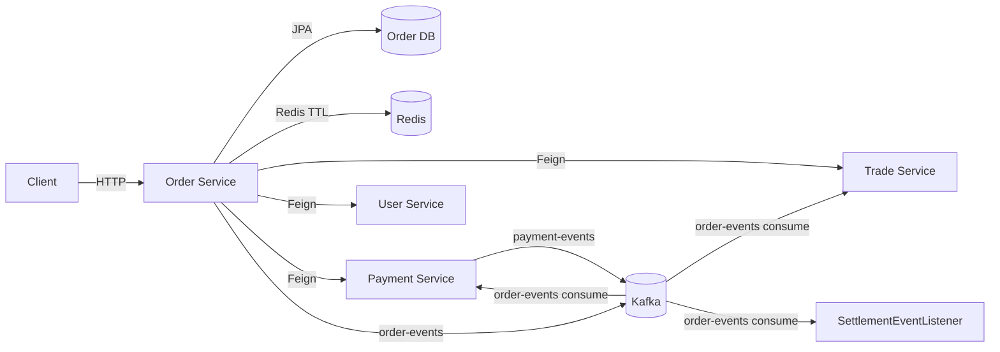
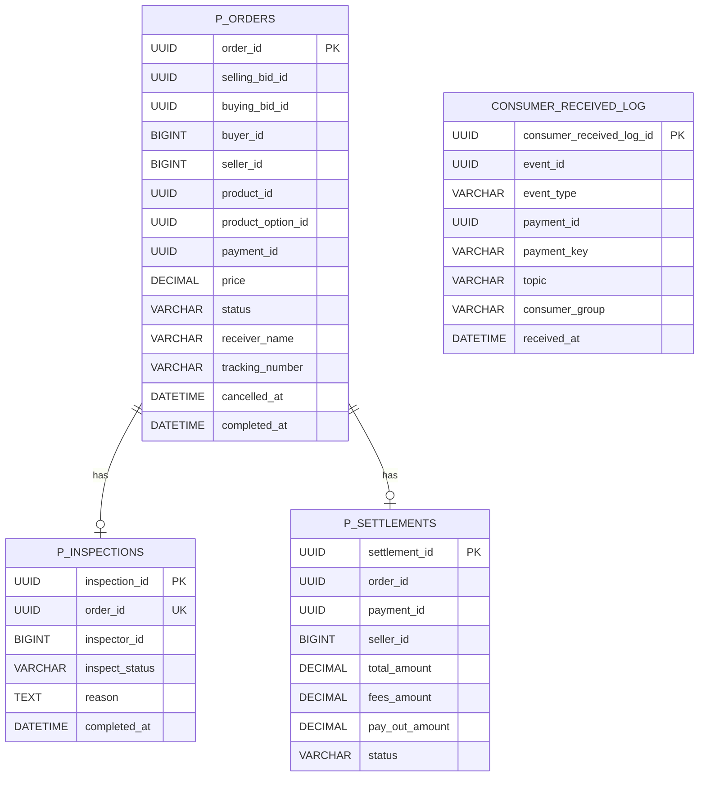
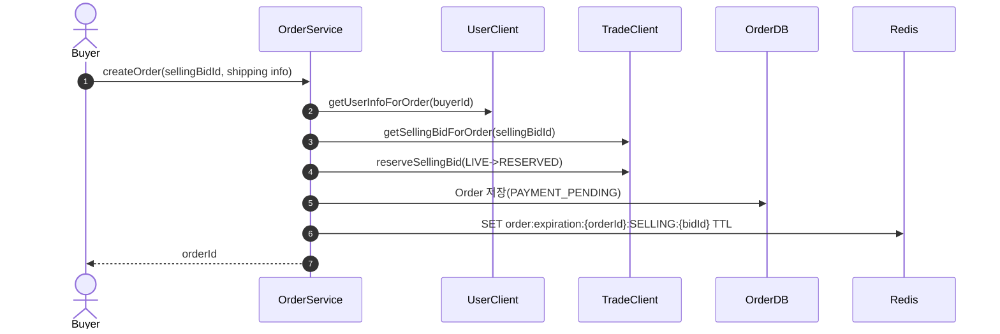
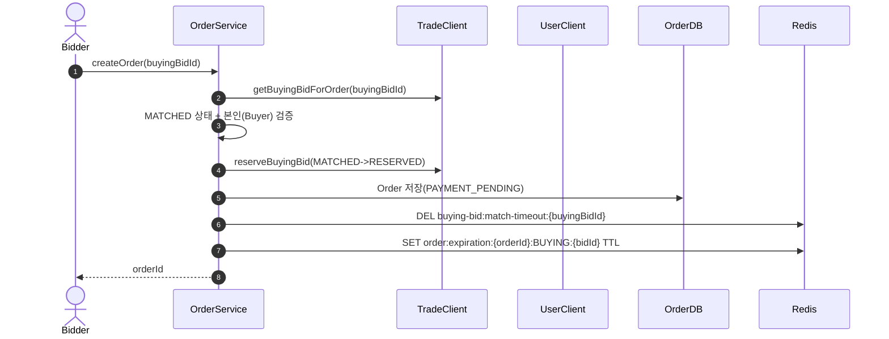
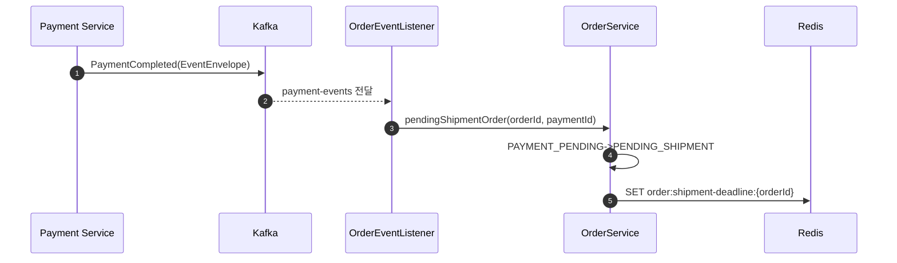
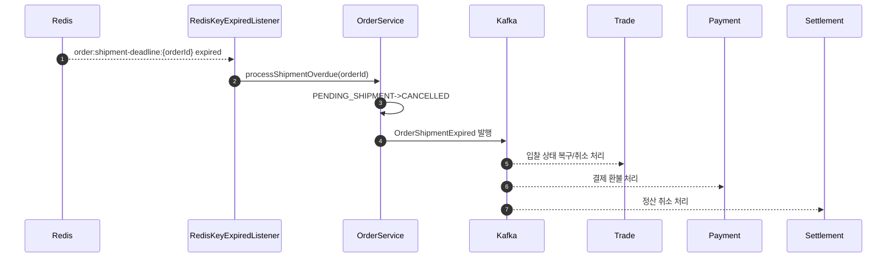

# Order Service Deep Dive

## 1. 왜 Order Service를 분리했는가

### 이유

Order Service는 "입찰 체결 이후의 거래 수명주기"를 소유하는 프로세스 중심 도메인입니다.

- Trade가 입찰 상태를 소유한다면, Order는 주문 상태 머신을 소유합니다.
- 결제, 배송, 검수, 환불, 정산으로 이어지는 후속 흐름은 단일 CRUD보다 오케스트레이션 성격이 강합니다.
- 상태 전이 규칙이 많고, 운영 정책 변경(환불/배송기한/검수 프로세스)이 잦아 독립 배포가 유리합니다.
- Redis 타임아웃과 Kafka 이벤트를 함께 다루는 비동기 조정 로직을 주문 경계에 집중시킬 수 있습니다.

### 역할

- 주문 생성/조회/취소/환불 요청
- 결제 완료 이벤트 반영 (`PAYMENT_PENDING -> PENDING_SHIPMENT`)
- 배송 기한 만료 자동 처리
- 검수 시작/합격/불합격 흐름 연동
- 정산 생성/확정/취소 트리거
- 주문 관련 이벤트(`order-events`) 발행

### 비책임

- 결제 승인/PG 통신 자체
- 입찰 선점 알고리즘 자체
- 사용자 인증 원천 데이터 소유

---

## 2. 서비스 접근 URL

### URL

- Order Swagger (dev): `https://dev.un-box.click/order/swagger-ui/index.html`
- Order Swagger (local): `http://localhost:8080/order/swagger-ui/index.html`
- Order API Base (dev): `https://dev.un-box.click/order`
- Grafana (dev): `https://grafana.dev.un-box.click/`

### 참고

- `application.yml` 기준 컨텍스트 경로는 `/order`
- Security 설정에서 ALB prefix Swagger 경로(`/order/**`)를 permit 처리

---

## 3. 아키텍처 개요

### 구조

- Presentation: 사용자/관리자/내부 컨트롤러
- Application: 주문/검수/정산 유즈케이스 서비스 + 이벤트 리스너/프로듀서
- Domain: `Order`, `Inspection`, `Settlement`, `ConsumerReceivedLog`
- Infrastructure: Redis TTL Listener, Kafka, Feign + Circuit Breaker

### 패키지

- `order/application/service`
  - `OrderServiceImpl`, `AdminOrderServiceImpl`, `InspectionServiceImpl`
  - `ConsumerReceivedLogService`
- `order/application/event`
  - `OrderEventListener` (payment-events 소비)
  - `RedisKeyExpiredListener` (Redis 만료 이벤트 소비)
  - `OrderEventProducer` (order-events 발행)
- `settlement/application`
  - `SettlementService`
  - `SettlementEventListener`
- `common/client`
  - `TradeClient`, `UserClient`, `PaymentClient`
  - `TradeClientFallbackFactory` (Resilience 보강)

### 런타임

---

## 4. Spring Boot 사용 방식

### 기술 매핑

| 영역            | 사용 기술                                  | 적용 위치                                                             | 사용 목적                 |
| :-------------- | :----------------------------------------- | :-------------------------------------------------------------------- | :------------------------ |
| Web             | Spring MVC                                 | `OrderController`, `Admin*Controller`, `OrderInternalController`      | Public/Admin/Internal API |
| Security        | Spring Security + JWT Filter               | `SecurityConfig`                                                      | 인증/인가                 |
| Method Security | `@EnableMethodSecurity`, `@PreAuthorize`   | 서비스/관리자 컨트롤러                                                | 관리자 권한 제한          |
| Persistence     | Spring Data JPA + Querydsl                 | `OrderRepository`, `AdminOrderRepositoryCustomImpl`                   | 주문/관리자 검색          |
| Messaging       | Spring Kafka                               | `OrderEventListener`, `SettlementEventListener`, `OrderEventProducer` | 이벤트 기반 상태 반영     |
| Cache/Event     | RedisTemplate + KeyExpirationEventListener | `OrderServiceImpl`, `RedisKeyExpiredListener`                         | 결제/배송/매칭 타임아웃   |
| Service Call    | OpenFeign + Resilience4j CB                | `TradeClient`, `TradeClientFallbackFactory`                           | 외부 서비스 호출 안정성   |
| Mapping         | MapStruct                                  | `OrderMapper`, `OrderClientMapper`, `Settlement*Mapper`               | DTO 매핑 일관성           |
| Observability   | Actuator + Micrometer + OTel               | `application.yml`                                                     | 메트릭/트레이싱           |

### 설정 특징

- `server.servlet.context-path: /order`
- Kafka consumer: `group-id=order-group`, `enable-auto-commit=false`, `StringDeserializer`
- Feign Circuit Breaker 활성화: `spring.cloud.openfeign.circuitbreaker.enabled=true`
- Resilience4j: `unbox-trade` 인스턴스 개별 튜닝(`waitDurationInOpenState`, `slowCallDurationThreshold`)
- Redis Keyspace Listener 사용 (`RedisMessageListenerContainer`)

---

## 5. API 계약

### Public API

#### 사용자 주문

- `POST /order/api/orders`
- `GET /order/api/orders`
- `GET /order/api/orders/{orderId}`
- `PATCH /order/api/orders/{orderId}/cancel`
- `PATCH /order/api/orders/{orderId}/tracking`
- `PATCH /order/api/orders/{orderId}/confirm`
- `PATCH /order/api/orders/{orderId}/refund`

#### 관리자 주문

- `GET /order/api/admin/orders`
- `GET /order/api/admin/orders/{orderId}`
- `PATCH /order/api/admin/orders/{orderId}/status`

#### 관리자 검수

- `POST /order/api/admin/inspections/start`
- `POST /order/api/admin/inspections/{inspectionId}/pass`
- `POST /order/api/admin/inspections/{inspectionId}/fail`
- `GET /order/api/admin/inspections/{orderId}`

### Internal API

#### 주문 내부

- `GET /order/internal/orders/{id}/for-review`
- `GET /order/internal/orders/{id}/for-payment`
- `POST /order/internal/orders/{id}/pending-shipment`

#### 정산 내부

- `GET /order/internal/settlement/{id}/for-payment`
- `POST /order/internal/settlement/create?paymentId=...`

### 보안 정책 요약

- Swagger/Actuator: permitAll
- `/internal/**`: permitAll
- `/api/admin/**`: `ROLE_MASTER`, `ROLE_MANAGER` (Security filter chain)
- 그 외 API: 인증 필요

---

## 6. 도메인 모델과 상태 전이

### 이유

Order는 외부 도메인(User/Product/Trade)와 강결합 FK를 줄이고, 주문 시점 스냅샷을 저장해 거래 이력 해석 안정성을 높입니다.

### 엔티티

- `p_orders`
  - 강한 참조: `selling_bid_id`, `buying_bid_id`, `buyer_id`, `seller_id`
  - 약한 참조: `product_id`, `product_option_id`
  - 스냅샷: `buyer_name`, `product_name`, `product_option_name`, `brand_name`, `model_number`
  - 배송정보: 수령인/주소/운송장, `payment_id`
- `p_inspections`
  - `order_id` unique, `inspector_id`, `inspect_status`, `reason`
- `p_settlements`
  - `order_id`, `payment_id`, `seller_id`, `fees_amount`, `pay_out_amount`, `status`
- `consumer_received_log`
  - `(event_id, consumer_group)` unique 제약으로 중복 기록 방지

### OrderStatus

- `PAYMENT_PENDING`
- `PENDING_SHIPMENT`
- `SHIPPED_TO_CENTER`
- `ARRIVED_AT_CENTER`
- `IN_INSPECTION`
- `INSPECTION_PASSED`
- `INSPECTION_FAILED`
- `SHIPPED_TO_BUYER`
- `DELIVERED`
- `COMPLETED`
- `CANCELLED`

### 주요 전이 경로

- 주문 생성: `PAYMENT_PENDING`
- 결제 완료 이벤트: `PAYMENT_PENDING -> PENDING_SHIPMENT`
- 판매자 운송장 등록: `PENDING_SHIPMENT -> SHIPPED_TO_CENTER`
- 관리자 검수 플로우:
  - `SHIPPED_TO_CENTER -> ARRIVED_AT_CENTER -> IN_INSPECTION`
  - `IN_INSPECTION -> INSPECTION_PASSED|INSPECTION_FAILED`
  - `INSPECTION_PASSED -> SHIPPED_TO_BUYER -> DELIVERED`
- 구매 확정: `DELIVERED -> COMPLETED`
- 취소/환불/배송기한 만료: `-> CANCELLED`

### ERD

---

## 7. 통신/일관성 설계

### 이유

Order는 동기 선점 검증과 비동기 후속 반영을 조합해 응답시간과 정합성을 균형 맞추는 구조입니다.

### 동기 통신 (Feign)

- `TradeClient`
  - 입찰 조회/선점/복구/매칭리셋
- `UserClient`
  - 주문자 정보 조회, 판매자 기본 계좌 보유 여부 확인
- `PaymentClient`
  - 정산 생성 시 결제 정보 조회

### 장애 대응

- Trade 호출은 `TradeClientFallbackFactory`로 예외 타입 분기
- `FeignClientException`(비즈니스 예외)은 원인 보존
- Circuit Open/네트워크 장애는 `SERVICE_UNAVAILABLE`로 fail-fast

### 비동기 통신 (Kafka)

#### Producer (`order-events`)

- `OrderCancelled`
- `OrderExpired`
- `OrderConfirmed`
- `OrderRefundRequested`
- `OrderShipmentExpired`

#### Consumer

- `payment-events` (`OrderEventListener`)
  - `PaymentCompleted` 수신 후 `pendingShipmentOrder` 호출
- `payment-events`/`order-events` (`SettlementEventListener`)
  - 결제완료 시 정산 생성
  - 환불/배송기한만료 시 정산 취소

### Redis 타임아웃 키

- `order:expiration:{orderId}:{type}:{bidId}`
  - 결제 제한시간 만료 트리거 (`type=SELLING|BUYING`)
- `order:shipment-deadline:{orderId}`
  - 판매자 미발송 타임아웃
- `buying-bid:match-timeout:{buyingBidId}`
  - 구매입찰 매칭 타임아웃 키 만료 감지 후 Trade reset 호출

### 정합성 특성

- 주문 생성 시 외부 선점 성공 후 Redis 타이머 설정 실패하면 보상 호출(`liveSellingBid/liveBuyingBid`)
- 배송 기한 만료는 DB 상태 변경 후 이벤트 발행으로 후속 서비스 환불/정산 취소를 트리거

---

## 8. 핵심 시퀀스

### 판매입찰 기반 주문 생성

### 구매입찰 기반 주문 생성

### 결제 완료 이벤트 반영

### 배송 미발송 타임아웃

---

## 9. 디자인 패턴과 적용 이유

### 이유

Order는 다수 서비스와 상호작용하는 프로세스 계층이라 설계 의도를 패턴으로 고정해야 변경 시 안정성이 유지됩니다.

### 패턴

| 패턴                     | 코드 위치                                | 적용 이유                    |
| :----------------------- | :--------------------------------------- | :--------------------------- |
| Saga-like Choreography   | `order-events`/`payment-events` 연쇄     | 2PC 없이 서비스 간 상태 전파 |
| Circuit Breaker Pattern  | `application.yml` + Feign CB             | 외부 장애 전파 차단          |
| Fallback Factory Pattern | `TradeClientFallbackFactory`             | 예외 원인별 fallback 분기    |
| Observer Pattern         | Kafka Listener/Producer                  | 비동기 후속처리              |
| State Machine Pattern    | `Order#validateAdminStatusTransition` 등 | 불법 상태 전이 차단          |
| Compensation Pattern     | `createOrder` 보상 호출                  | 부분 실패 시 선점 복구       |
| Idempotency Pattern      | `ConsumerReceivedLog` unique 제약        | 이벤트 중복 기록 방지        |
| Repository Pattern       | `*Repository`                            | 도메인/영속성 분리           |
| Snapshot Pattern         | `Order` 스냅샷 필드                      | 원격 변경과 무관한 이력 보존 |
| Builder Pattern          | 엔티티/DTO 생성                          | 가독성 및 생성 안정성        |

---

## 10. CS 관점

### 핵심

- Sync + Async Hybrid
  - 생성 시에는 동기 선점으로 강한 검증,
  - 후속 전이는 Kafka/Redis 이벤트로 비동기 처리합니다.
- Failure Isolation
  - CB + fallback으로 외부 장애를 주문 서비스 내부에서 제한합니다.
- Timeout-driven Workflow
  - Redis key-expired를 트리거로 사용해 스케줄러 폴링 부담을 줄입니다.
- Eventual Consistency
  - Trade/Payment/Settlement 반영은 일시적 불일치를 허용하는 모델입니다.
- Process-centered Domain
  - Order는 데이터 저장소이면서 상태 머신 엔진 역할을 동시에 수행합니다.

---

## 11. 보완해야 할 사항 (우선순위)

### P0

1. Redis 만료 키 파싱 로직 오류

- `RedisKeyExpiredListener#handleOrderExpired`는 `parts.length != 4` 검사 후 `parts[4]`를 접근합니다.
- 현재 생성 키 포맷은 `order:expiration:{orderId}:{type}:{bidId}`라 최소 5조각입니다.

2. 관리자 권한 정책 충돌

- `SecurityConfig`는 `/api/admin/**`를 `MASTER/MANAGER`만 허용합니다.
- `AdminInspectionController`는 `INSPECTOR` 권한 허용을 선언하지만 filter에서 선차단되어 Inspector 접근이 막힙니다.

3. 결제 완료 후 결제만료 키 정리 부재

- 주문 생성 시 `order:expiration:*`를 생성하지만 결제 완료(`pendingShipmentOrder`)에서 삭제하지 않습니다.
- 만료 이벤트가 불필요하게 후속 시스템으로 퍼질 수 있습니다.

4. 결제 타임아웃 시 Order 상태 갱신 경로 불명확

- 만료 시 `OrderExpiredEvent`는 발행되지만 Order 서비스 내부에서 `PAYMENT_PENDING -> CANCELLED`를 명시적으로 처리하는 소비 경로가 보이지 않습니다.

### P1

1. 검수 권한 검증 불일치

- `InspectionServiceImpl#passInspection`은 검사자 본인 검증이 있지만 `failInspection`에는 동일 검증이 없습니다.

2. 사용자 취소 가능 상태 정책 재점검

- `Order#cancel()`은 `ARRIVED_AT_CENTER`, `IN_INSPECTION` 같은 상태를 직접 금지하지 않습니다.
- 현재 정책 의도(결제 후 환불 전용)와 실제 도메인 가드가 완전히 일치하는지 확인이 필요합니다.

3. Producer Outbox 부재

- 주문 이벤트는 DB 트랜잭션과 별도로 직접 Kafka 발행합니다.
- 커밋/발행 사이 장애 구간에 대한 내구성 보강 여지가 있습니다.

4. 이벤트 수신 로그 범위 제한

- `ConsumerReceivedLogService`는 `paymentKey`가 `test_success_*`인 경우에만 기록합니다.
- 운영 트래픽 전체 멱등/감사 추적에는 부족할 수 있습니다.

### P2

1. 정산 상태 머신 고도화

- `SettlementStatus` enum은 다단계지만 실제 로직은 `PENDING/PAID_OUT/CANCELLED` 중심으로 사용됩니다.

2. 타임아웃/이벤트 관측성 강화

- 키 만료 처리 성공률, 이벤트 지연, 보상 호출 실패율 등 운영 지표를 명시적으로 메트릭화할 필요가 있습니다.

3. 검수 불합격 후 자동 후속처리 명확화

- `INSPECTION_FAILED` 이후 환불/정산취소 자동 연계 정책이 코드상 일관되게 보이지 않아 운영 규칙 문서화가 필요합니다.

---

## 12. 운영 체크리스트

### 체크 항목

- Swagger: `https://dev.un-box.click/order/swagger-ui/index.html`
- Grafana: `https://grafana.dev.un-box.click/`
- Kafka:
  - `payment-events`(order-group) consumer lag
  - `order-events` produce 실패율
  - `settlement-group` consumer lag
- Redis:
  - `order:expiration:*` 생성/만료량
  - `order:shipment-deadline:*` 만료 후 처리 성공률
  - `buying-bid:match-timeout:*` 만료 reset 성공률
- Circuit Breaker:
  - `resilience4j_circuitbreaker_state{name="unbox-trade"}`
  - fallback 발생 빈도
- 주문 품질:
  - 상태 전이 실패(`INVALID_ORDER_STATUS*`) 비율
  - 보상 호출(`ORDER_ROLLBACK`) 실패 로그 추적
