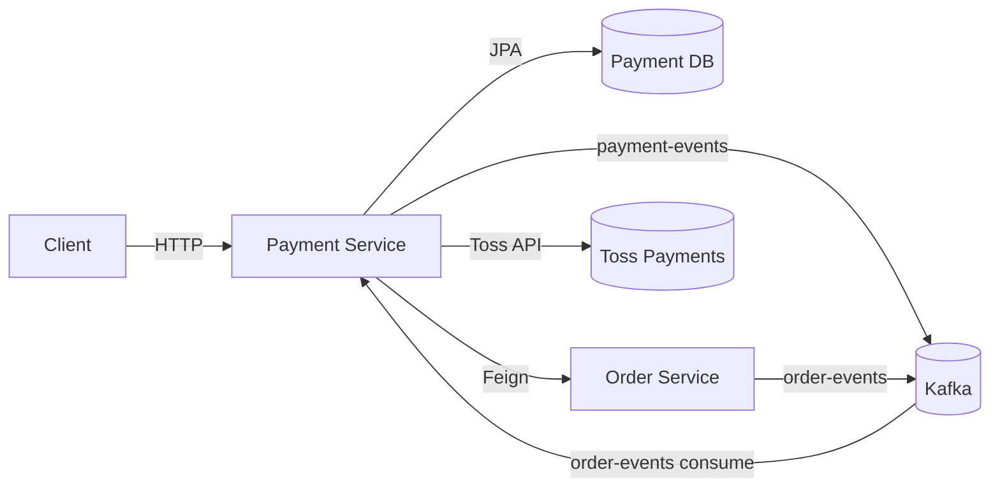
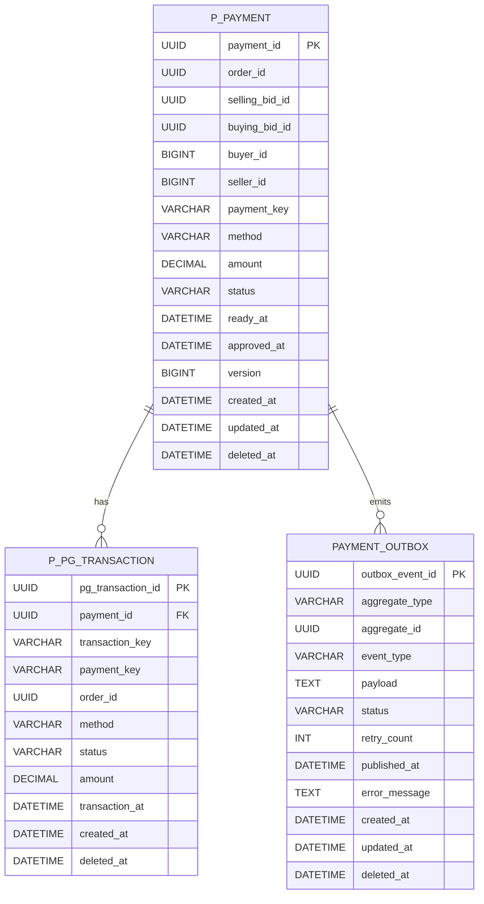
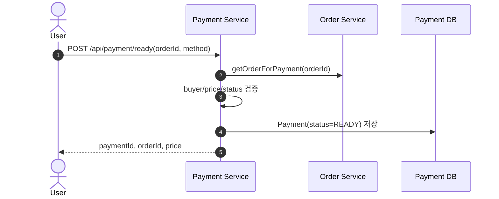
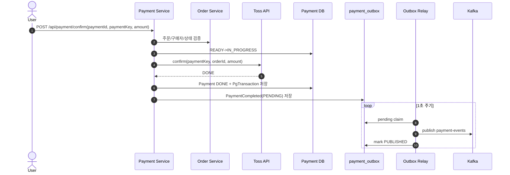
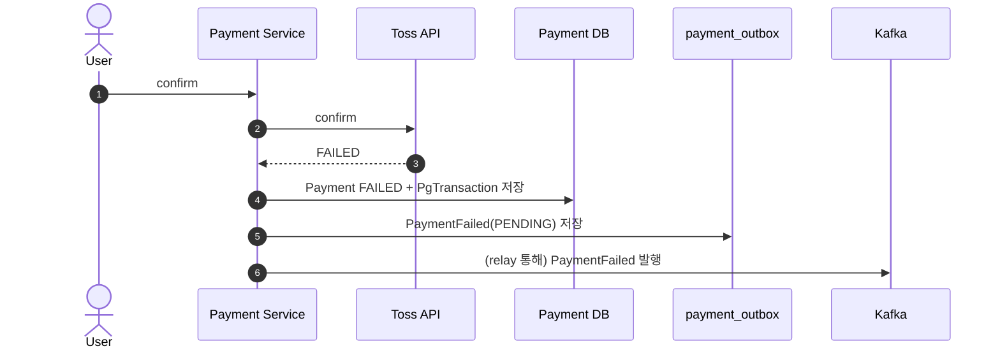
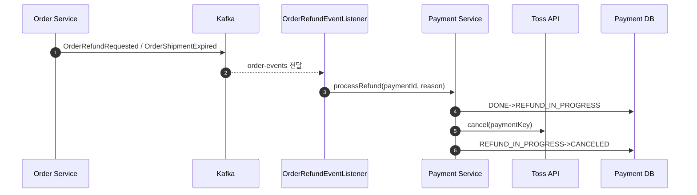

# Payment Service Deep Dive

## 1. 왜 Payment Service를 분리했는가

### 이유

Payment Service는 "외부 PG 연동 + 결제 상태 머신 + 결제 이벤트 전파"를 독립 경계로 관리하기 위해 분리되었습니다.

- PG(Toss) 호출은 네트워크 지연/장애 전파 가능성이 높아 주문/입찰 도메인과 격리할 필요가 있습니다.
- 결제는 금액 검증, 중복 승인 방지, 환불, 감사 추적까지 요구되어 단순 CRUD보다 트랜잭션 정책이 중요합니다.
- 결제 성공/실패를 Trade/Order/Settlement에 비동기로 전달해야 하므로 메시징 신뢰성 패턴(Outbox, 재시도, 복구)을 독립 진화시키기 좋습니다.
- 결제 도메인 변경 주기(정책/PG API/보안)가 주문/입찰과 달라 독립 배포 이점이 큽니다.

### 역할

- 결제 준비(`READY`) 생성
- 결제 승인(`READY -> IN_PROGRESS -> DONE|FAILED`)
- 주문 이벤트 기반 환불(`DONE -> REFUND_IN_PROGRESS -> CANCELED`)
- 결제 이벤트(`PaymentCompleted`, `PaymentFailed`) 발행
- 정산/주문 서비스용 내부 조회 API 제공

### 비책임

- 주문 생성/검수/배송 상태 머신 소유
- 입찰 생성/매칭/선점 소유
- 사용자 원천 인증 데이터 소유

---

## 2. 서비스 접근 URL

### URL

- Payment Swagger (dev): `https://dev.un-box.click/payment/swagger-ui/index.html`
- Payment Swagger (local): `http://localhost:8080/payment/swagger-ui/index.html`
- Payment API Base (dev): `https://dev.un-box.click/payment`
- Grafana (dev): `https://grafana.dev.un-box.click/`

### 참고

- `application.yml` 기준 컨텍스트 경로는 `/payment`
- Security 설정에서 ALB prefix Swagger 경로(`/payment/**`) permit 처리
- OpenAPI 서버 정의에는 구 ALB URL도 함께 남아 있음

---

## 3. 아키텍처 개요

### 구조

- Presentation: `PaymentController`, `PaymentInternalController`
- Application: `PaymentServiceImpl`, `PaymentTransactionService`, `TossApiService`
- Event: `PaymentOutboxWriter`, `PaymentOutboxMessageRelay`, `OrderRefundEventListener`
- Domain: `Payment`, `PgTransaction`, `PaymentOutboxEvent`
- Infrastructure: Kafka, Feign(Order), Scheduler, JPA

### 패키지

- `payment/application/service`
  - `PaymentServiceImpl`, `PaymentTransactionService`, `PaymentOutboxService`, `TossApiService`
- `payment/application/event`
  - `listener/OrderRefundEventListener`
  - `producer/PaymentEventProducer`, `PaymentDirectAsyncEventProducer`
  - `relay/PaymentOutboxMessageRelay`
- `payment/domain`
  - `entity/Payment`, `PgTransaction`, `PaymentOutboxEvent`
  - `repository/*Repository`
- `common/client`
  - `OrderClient` (실사용)
  - `SettlementClient`, `TradeClient` (현재 미사용)

### 런타임

---

## 4. Spring Boot 사용 방식

### 기술 매핑

| 영역            | 사용 기술                         | 적용 위치                                        | 사용 목적                          |
| :-------------- | :-------------------------------- | :----------------------------------------------- | :--------------------------------- |
| Web             | Spring MVC                        | `PaymentController`, `PaymentInternalController` | Public/Internal API                |
| Security        | Spring Security + JWT Filter      | `SecurityConfig`                                 | 무상태 인증/인가                   |
| Method Security | `@EnableMethodSecurity`           | `SecurityConfig`                                 | 메서드 권한 확장 기반              |
| Persistence     | Spring Data JPA                   | `PaymentRepository`, `PgTransactionRepository`   | 결제/PG이력/Outbox 영속성          |
| Messaging       | Spring Kafka                      | Producer/Listener/Relay                          | 결제 이벤트 발행, 주문 이벤트 소비 |
| Scheduling      | `@EnableScheduling`, `@Scheduled` | `PaymentOutboxMessageRelay`                      | Outbox 릴레이/복구                 |
| Service Call    | OpenFeign                         | `OrderClient`                                    | 결제 대상 주문 검증                |
| Mapping         | MapStruct                         | `PaymentMapper`, `PgTransactionMapper`           | DTO/Entity 매핑 일관화             |
| Docs            | springdoc-openapi                 | `SwaggerConfig`                                  | Swagger/OpenAPI                    |
| Observability   | Actuator + Micrometer + OTel      | `application.yml`                                | health/metric/trace                |

### 설정 특징

- `server.servlet.context-path: /payment`
- Kafka: `group-id=payment-group`, `enable-auto-commit=false`, producer `acks=all`
- Outbox 릴레이: `@Scheduled(fixedDelay = 1000)`
- Stuck 복구: `@Scheduled(fixedDelay = 60000, initialDelay = 60000)`
- DB 커넥션 풀: `maximum-pool-size=5`
- Dev/Prod 프로파일은 MSK IAM(`SASL_SSL`, `AWS_MSK_IAM`) 설정 사용

---

## 5. API 계약

### Public API

#### 사용자 결제

- `GET /payment/api/payment/history`
- `POST /payment/api/payment/ready`
- `POST /payment/api/payment/confirm`

### Internal API

#### 내부 결제 조회

- `GET /payment/internal/payments/{paymentId}/for-settlement`
- `GET /payment/internal/payments/orders/{orderId}/status`

### 이벤트 소비

- Topic: `order-events`
- Event:
  - `OrderRefundRequested`
  - `OrderShipmentExpired`

### 보안 정책 요약

- Swagger/Actuator: permitAll
- `/internal/**`: permitAll
- `/api/admin/**`: `ROLE_MASTER`, `ROLE_MANAGER`
- 그 외 API: 인증 필요

---

## 6. 도메인 모델과 상태 전이

### 이유

Payment는 결제 원장(`Payment`), PG 외부 트랜잭션 로그(`PgTransaction`), 이벤트 전달 보장(`PaymentOutboxEvent`)을 분리해 책임을 명확히 유지합니다.

### 엔티티

- `p_payment`
  - 주문/입찰/구매자/판매자 참조
  - 결제 수단/금액/상태/준비시각/승인시각
  - `@Version` 기반 낙관적 락
- `p_pg_transaction`
  - 결제 승인/실패/취소 등 PG 거래 이력 저장
  - `payment_key`, `transaction_key`, `status`, `transaction_at`
- `payment_outbox`
  - 발행 대기 이벤트 저장
  - `status(PENDING/PROCESSING/PUBLISHED/FAILED)`, `retry_count`, `published_at`

### 상태

- `PaymentStatus`
  - `READY`, `IN_PROGRESS`, `DONE`, `REFUND_IN_PROGRESS`, `CANCELED`, `FAILED`
- `PaymentOutboxEventStatus`
  - `PENDING`, `PROCESSING`, `PUBLISHED`, `FAILED`
- `PgTransactionStatus`
  - `READY`, `IN_PROGRESS`, `DONE`, `CANCELED`, `FAILED`, `EXPIRED` 등

### 주요 전이

- 준비: `createPayment` -> `READY`
- 승인 시도: `READY -> IN_PROGRESS`
- 승인 성공: `IN_PROGRESS -> DONE`
- 승인 실패: `IN_PROGRESS -> FAILED`
- 환불: `DONE -> REFUND_IN_PROGRESS -> CANCELED`

### ERD

---

## 7. 통신/일관성 설계

### 이유

Payment는 결제 승인 같은 외부 I/O 구간과 상태 변경 구간을 분리해 응답 지연과 데이터 정합성을 동시에 관리하려는 구조입니다.

### 동기 통신 (Feign)

- `OrderClient`
  - 주문 결제 가능 상태/금액/구매자 검증 (`/internal/orders/{id}/for-payment`)
- `SettlementClient`, `TradeClient`
  - 클라이언트 인터페이스는 존재하지만 현재 Payment 서비스 런타임 경로에서는 사용되지 않음

### 비동기 통신 (Kafka)

#### Producer (`payment-events`)

- `PaymentCompleted`
- `PaymentFailed`
- Payload는 `EventEnvelope` 표준(`eventId`, `eventType`, `occurredAt`, `aggregateId`, `data`)

#### Consumer (`order-events`)

- `OrderRefundRequested`
- `OrderShipmentExpired`
- 수신 후 `paymentService.processRefund(paymentId, reason)` 실행

### Redis 사용 현황

- `application.yml`에 Redis 연결 설정은 존재
- 현재 Payment 서비스 도메인 코드에서는 RedisTemplate/캐시를 사용하지 않음

### Outbox 릴레이 요약

- PENDING 이벤트를 배치로 Claim
- 상태를 PROCESSING으로 전환
- Kafka 발행 성공 시 PUBLISHED, 실패 시 재시도(PENDING) 또는 FAILED
- 5분 이상 PROCESSING으로 남은 이벤트를 복구 스케줄러가 재대기 상태로 복원

---

## 8. 핵심 시퀀스

### 결제 준비

### 결제 승인 성공 (기본 Outbox 경로)

### 결제 승인 실패

### 주문 환불/배송만료 이벤트 소비

---

## 9. 디자인 패턴과 적용 이유

### 패턴

| 패턴                         | 코드 위치                                          | 적용 이유                              |
| :--------------------------- | :------------------------------------------------- | :------------------------------------- |
| Transactional Outbox Pattern | `PaymentOutboxWriter`, `PaymentOutboxMessageRelay` | DB 상태 변경과 이벤트 발행 결합도 완화 |
| Polling Publisher Pattern    | `@Scheduled publishPendingEvents`                  | Broker 독립적으로 안정 발행            |
| Recovery Pattern             | `recoverStuckProcessingEvents`                     | 워커 비정상 종료 후 자동 복구          |
| Envelope Pattern             | `EventEnvelope`                                    | 다형 이벤트 소비 표준화                |
| Proxy Pattern                | `@FeignClient`, `KafkaTemplate`                    | 외부 시스템 연동 추상화                |
| Repository Pattern           | `*Repository`                                      | 도메인 로직/영속성 관심사 분리         |
| State Machine Pattern        | `PaymentStatus`, `changeStatus`                    | 불법 상태 전이 방지                    |
| Builder Pattern              | Entity/Event/DTO Builder                           | 생성 코드 가독성 및 누락 방지          |
| Idempotency Key Pattern      | `TossApiService`의 `Idempotency-Key` 헤더          | PG 재시도 시 중복 승인 방지            |

---

## 10. CS 관점

### 핵심

- External I/O 분리
  - PG 호출을 DB 트랜잭션과 분리해 커넥션 점유 시간을 줄이는 구조를 지향합니다.
- At-least-once 메시징
  - Outbox + 재시도로 이벤트 유실을 줄이되, 중복 소비 가능성을 고려한 소비자 멱등성이 필요합니다.
- Partition Ordering
  - aggregateId(입찰/주문 ID)를 키로 사용해 관련 이벤트 순서를 보존합니다.
- Failure Isolation
  - 결제 승인 실패와 이벤트 발행 실패를 분리해 후속 재처리가 가능하도록 설계합니다.
- Eventual Consistency
  - Trade/Order/Settlement 반영은 비동기라 짧은 시간의 상태 불일치를 허용합니다.

---

## 11. 보완해야 할 사항 (우선순위)

### P0

1. Outbox 원자성 깨짐

- `processSuccessfulPayment/processFailedPayment` 커밋 후 `paymentOutboxWriter.write(...)`를 별도 호출합니다.
- 결제 상태 변경과 Outbox 저장이 단일 트랜잭션이 아니라 장애 순간에 이벤트 유실 가능성이 있습니다.

2. `@Transactional` Self-Invocation으로 트랜잭션 경계 의도 불일치

- `PaymentTransactionService#prepareForConfirm -> markAsInProgress`
- `PaymentOutboxMessageRelay#publishPendingEvents -> claimPendingEvents/processEventInSeparateTransaction`
- 같은 클래스 내부 호출이라 `REQUIRES_NEW`가 적용되지 않아 동시성/격리 의도가 깨질 수 있습니다.

3. 환불 취소 실패를 삼켜도 로컬 상태를 `CANCELED`로 변경

- `TossApiService#cancel`은 예외를 로그만 남기고 swallow 합니다.
- PG 취소가 실제 실패해도 `completeRefund`가 실행되어 정산/감사 정합성 문제가 생길 수 있습니다.

### P1

1. 내부 API 공개 범위

- `/internal/**`가 permitAll입니다.
- 게이트웨이/네트워크 ACL 없으면 공격면이 커집니다.

2. 테스트 전용 Direct Async 경로 운영 노출

- `X-Test-Mode: async` 헤더만으로 Outbox 우회 발행이 가능합니다.
- 운영 프로파일에서 강제 차단(feature flag 또는 profile guard) 필요합니다.

3. Stuck 복구 기준 시각 개선 필요

- 현재 복구 기준은 `created_at` 중심이라 대기열이 오래된 이벤트 처리 중 오탐 가능성이 있습니다.
- `processing_started_at` 같은 별도 기준 컬럼 도입이 안전합니다.

4. 사용되지 않는 연동 코드 정리

- `TradeClient`, `SettlementClient`, Redis 설정은 현재 런타임 핵심 경로에서 미사용입니다.
- 운영 문서/코드 간 괴리를 줄이기 위해 정리 또는 사용 목적 명시가 필요합니다.

5. 외부 API 내결함성 보강

- `TossApiService`는 `new RestTemplate()` 단순 호출로 timeout/retry/circuit-breaker 정책이 약합니다.

### P2

1. Outbox 데이터 관리 전략

- 장기 운영 시 `payment_outbox` 아카이빙/파티셔닝 정책 필요

2. 관측성 지표 고도화

- Outbox 상태별 건수, 재시도율, 복구 건수, PG 취소 실패율을 메트릭화해야 원인 분석이 빨라집니다.

3. 요청 DTO 검증 강화

- `@Valid`는 있으나 `PaymentCreateRequestDto`, `PaymentConfirmRequestDto` 필드 제약이 약합니다.
- null/음수/빈 문자열 정책을 어노테이션으로 명시하는 편이 계약에 안전합니다.

---

## 12. 운영 체크리스트

### 체크 항목

- Swagger: `https://dev.un-box.click/payment/swagger-ui/index.html`
- Grafana: `https://grafana.dev.un-box.click/`
- Kafka:
  - `payment-events` publish 실패율
  - `order-events` (`payment-group`) consumer lag
- Outbox:
  - `PENDING/PROCESSING/FAILED` 건수 추이
  - retry_count 상위 이벤트
  - stuck 복구 건수
- PG 연동:
  - Toss confirm/cancel 지연(p95/p99)
  - confirm 실패 코드 분포
  - cancel 실패 후 재시도 성공률
- 결제 품질:
  - `PAYMENT_IN_PROGRESS`, `AMOUNT_MISMATCH`, `PAYMENT_EXPIRED` 비율
  - 환불 처리 실패 로그/재처리 건수
