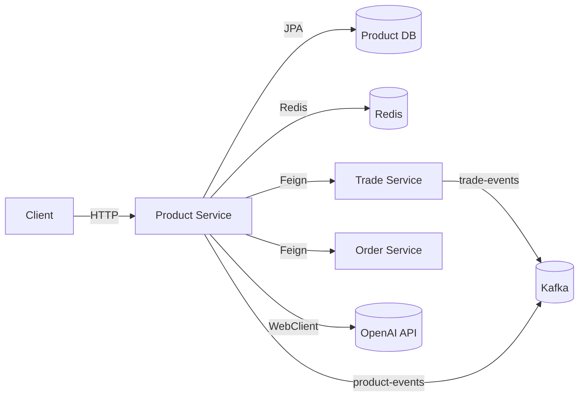
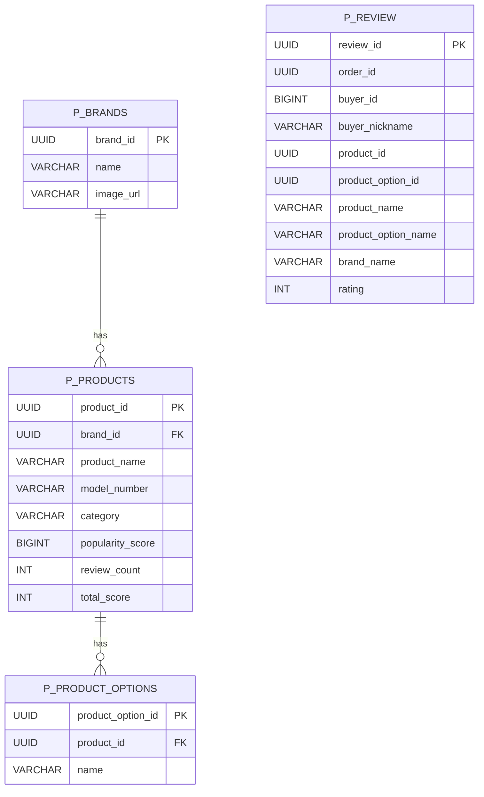
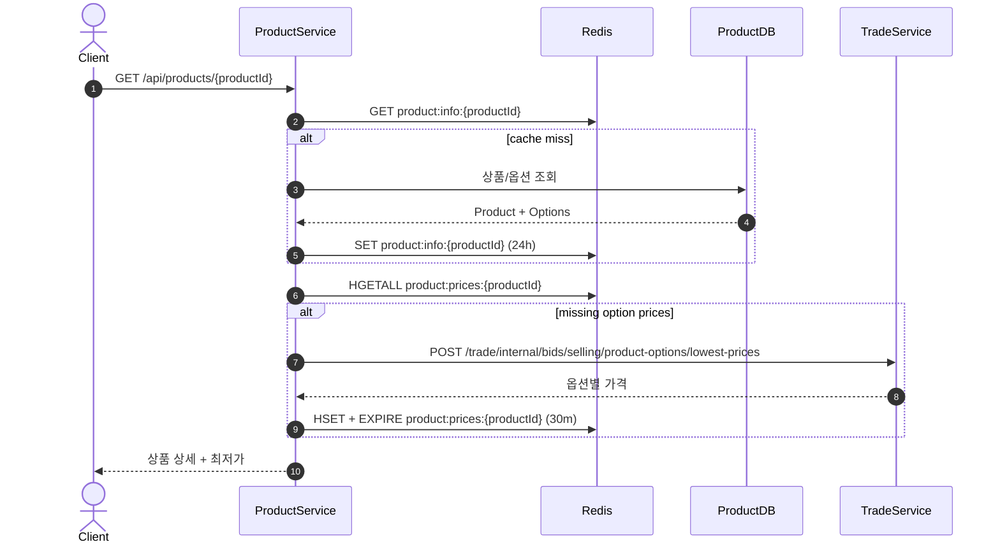
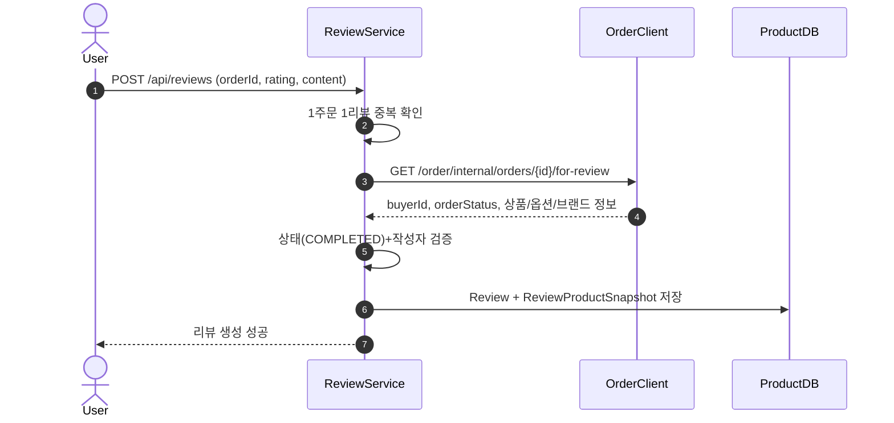
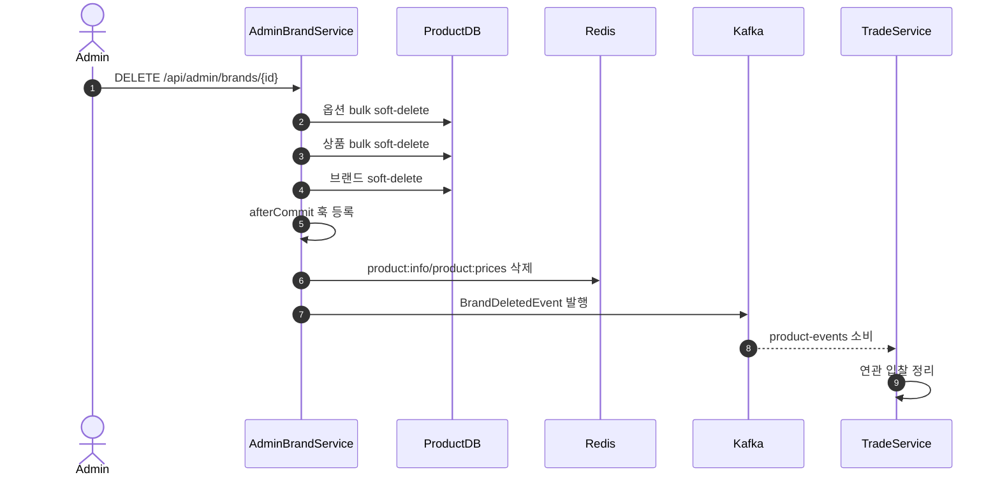

# Product Service Deep Dive

## 1. 왜 Product Service를 분리했는가

### 이유

Product Service는 "상품 카탈로그 + 탐색/조회 + 리뷰 + 가격 조회 최적화"를 전담하는 Read-heavy 도메인으로 분리되었습니다.

- 상품/브랜드/옵션/리뷰는 조회 트래픽이 매우 높고 쓰기 트래픽보다 비대칭
- 거래(Trade) 도메인과 가격 계산/매칭 관심사를 분리해야 모델 복잡도를 낮출 수 있음
- 카탈로그와 AI 요약 기능의 릴리즈 주기가 주문/결제와 다름
- 가격은 Trade가 소유하고 Product는 캐시/조회 관점으로 소비하는 구조가 자연스러움

### 역할

- 브랜드/상품/옵션 관리
- 상품 목록/상세/옵션/리뷰 제공
- 인기 점수/가격 캐시로 조회 최적화
- AI 리뷰 요약
- 상품 삭제 이벤트 발행

### 비책임

- 입찰 상태 변경
- 주문 상태 전이
- 결제 승인/정산

---

## 2. 서비스 접근 URL

### URL

- Product Swagger (dev): `https://dev.un-box.click/product/swagger-ui/index.html`
- Product Swagger (local): `http://localhost:8080/product/swagger-ui/index.html`
- Product API Base (dev): `https://dev.un-box.click/product`
- Grafana (dev): `https://grafana.dev.un-box.click/`

### 참고

- `application.yml` 기준 컨텍스트 경로는 `/product`
- OpenAPI 서버 정의에도 `/product` prefix가 반영되어 있음

---

## 3. 아키텍처 개요

### 구조

- Presentation: Controller + API Interface
- Application: Product/Review/Admin/Ai 유즈케이스 Service
- Domain: Brand/Product/ProductOption/Review(+Snapshot)
- Infrastructure: RedisTemplate, Kafka Producer/Consumer, Feign, WebClient(OpenAI)

### 패키지

- `product`: 브랜드/상품/옵션(관리자 + 사용자 조회)
- `reviews`: 리뷰 CRUD + 내부 리뷰 조회
- `ai`: 리뷰 요약
- `common/client`: Trade/Order Feign
- `product/application/event`: Kafka producer/listener

### 런타임

---

## 4. Spring Boot 사용 방식

### 기술 매핑

| 영역            | 사용 기술                                | 적용 위치                                    | 사용 목적                   |
| :-------------- | :--------------------------------------- | :------------------------------------------- | :-------------------------- |
| Web             | Spring MVC                               | `*Controller`                                | Public/Internal/Admin API   |
| Security        | Spring Security + JWT Filter             | `SecurityConfig`                             | 인증/권한, 무상태 요청 처리 |
| Method Security | `@EnableMethodSecurity`, `@PreAuthorize` | Admin 서비스 계층                            | 관리자 권한 강제            |
| Persistence     | Spring Data JPA                          | `*Repository`, `*Entity`                     | 카탈로그/리뷰 영속성        |
| Cache/Data      | RedisTemplate                            | `ProductServiceImpl`, `TradeEventListener`   | 상세/가격/인기 키 관리      |
| Messaging       | Spring Kafka                             | `TradeEventListener`, `ProductEventProducer` | 가격 반영/삭제 전파         |
| Service Mesh    | OpenFeign                                | `TradeClient`, `OrderClient`                 | 최저가 조회/리뷰 검증       |
| AI              | WebClient                                | `AiService`                                  | OpenAI 요약 호출            |
| Docs            | springdoc-openapi                        | `SwaggerConfig`                              | API 문서/서버 정보          |
| Observability   | Actuator + Micrometer + OTel             | `application.yml`                            | 지표/트레이싱               |

### 설정 특징

- `server.servlet.context-path: /product`
- Kafka consumer: `enable-auto-commit: false`, Listener에서 `Acknowledgment` 사용
- Redis 주요 TTL: `product:info:*` 24h, `product:prices:*` 30m
- Dev/Prod 프로파일에서 MSK IAM 인증(SASL_SSL + AWS_MSK_IAM) 사용

---

## 5. API 계약

### Public API

#### 카탈로그 조회

- `GET /product/api/products`
- `GET /product/api/products/{productId}`
- `GET /product/api/products/{productId}/options`
- `GET /product/api/products/brands`
- `GET /product/api/products/{productId}/reviews`

#### 리뷰

- `POST /product/api/reviews`
- `GET /product/api/reviews/my-reviews`
- `GET /product/api/reviews/{reviewId}`
- `PATCH /product/api/reviews/{reviewId}`
- `DELETE /product/api/reviews/{reviewId}`

#### AI

- `GET /product/api/ai/reviews/summary/{productId}`

#### 관리자

- `GET/POST/PATCH/DELETE /product/api/admin/brands*`
- `GET/POST/PATCH/DELETE /product/api/admin/products*`
- `GET/POST/DELETE /product/api/admin/products/{productId}/options*`

### Internal API

- `GET /product/internal/products/options/{id}/for-order`
- `GET /product/internal/products/options/{id}/for-selling-bid`
- `GET /product/internal/products/options/{id}/for-buying-bid`
- `GET /product/internal/reviews/products/{productId}`

### 테스트 API

- `GET /product/api/test/products/v1`
- `GET /product/api/test/products/v2`

### 보안 정책 요약

- `/api/admin/**`: `ROLE_MASTER`, `ROLE_MANAGER`만 허용
- `/internal/**`: 현재 permitAll (네트워크/게이트웨이 레벨 보호 필요)
- `/api/test/products/**`: 현재 permitAll (테스트 목적)
- 그 외: 인증 필요

---

## 6. 데이터 모델 (Service-local)

### 이유

카탈로그는 정규화 관계를 유지하고, 리뷰는 스냅샷을 내장해 과거 무결성을 보장하는 혼합 모델을 채택했습니다.

### 엔티티

- `p_brands`: 브랜드 마스터
- `p_products`: 상품 마스터, `reviewCount/totalScore/popularityScore` 포함
- `p_product_options`: 상품 옵션
- `p_review`: 리뷰 본문 + 작성자/주문/상품 스냅샷

### 모델 특징

- Product는 Brand에 ManyToOne
- ProductOption은 Product에 ManyToOne
- Review는 `ReviewProductSnapshot(@Embeddable)`를 저장해 과거 정보 보존
- 공통적으로 `BaseEntity + @SQLRestriction("deleted_at IS NULL")` 기반 soft-delete

### ERD

---

## 7. 캐시/통신 설계

### 이유

Product는 읽기 성능이 핵심이라 Cache-Aside + 이벤트 반영 혼합 전략을 사용합니다.

### Redis 캐시 전략

#### 핵심 키

- `product:info:{productId}` (Value, TTL 24h)
- `product:prices:{productId}` (Hash, TTL 30m)
- `products:popular:all` (ZSet)
- `product:detail:{productId}` (테스트 V2 경로, TTL 1h)

#### 읽기 전략

1. 상품 상세 조회 시 `product:info` 조회
2. miss면 DB 조회 후 24h 캐싱
3. 가격 Hash 조회
4. 누락 옵션은 Trade 배치 조회로 보충 후 Hash 캐시

#### 일관성 유지

- Admin 수정/삭제 시 관련 키 삭제
- Trade 가격 이벤트 수신 시 Hash 업데이트
- Brand/Product/ProductOption 삭제는 afterCommit 이후 캐시 삭제 + 이벤트 발행

### 동기 통신

#### Feign

- `TradeClient`
  - 옵션별 최저가 조회/배치 조회
- `OrderClient`
  - 리뷰 작성 가능 여부 검증에 필요한 주문 내부 조회

### 비동기 통신

#### Producer (`product-events`)

- `BrandDeletedEvent`
- `ProductDeletedEvent`
- `ProductOptionDeletedEvent`

#### Consumer (`trade-events`)

- `TradePriceChangedEvent`
- 처리: `product:prices:{productId}` hash field 갱신 후 ack

---

## 8. 핵심 시퀀스

### 상품 상세 조회 (캐시 미스 -> 가격 배치 보강)

### 리뷰 생성 (Order 검증 + Snapshot 저장)

### 브랜드 삭제 전파 (afterCommit)

---

## 9. 디자인 패턴과 적용 이유

### 이유

Product는 카탈로그 CRUD + 캐시 + 이벤트 + 외부호출이 결합된 서비스라 패턴을 명시해야 리팩토링 시 설계 의도가 유지됩니다.

### 패턴

| 패턴                | 코드 위치                                                                                                | 적용 이유                                 |
| :------------------ | :------------------------------------------------------------------------------------------------------- | :---------------------------------------- |
| Cache-Aside Pattern | `ProductServiceImpl#getProductDetail/getProductOptions`                                                  | 조회 성능 향상 + DB/Trade 호출 감축       |
| Proxy Pattern       | `@FeignClient(TradeClient, OrderClient)`                                                                 | 외부 서비스 연동 결합도 축소              |
| Observer Pattern    | `TradeEventListener`, `ProductEventProducer`                                                             | 가격/삭제 전파를 느슨하게 연결            |
| Snapshot Pattern    | `ReviewProductSnapshot`                                                                                  | 과거 리뷰 해석 안정성 확보                |
| After-Commit Hook   | Admin 삭제 서비스의 `TransactionSynchronization`                                                         | 커밋 후 캐시 삭제/이벤트 발행 정합성 확보 |
| Factory Method      | `Brand.createBrand`, `Product.createProduct`, `ProductOption.createProductOption`, `Review.createReview` | 생성 규칙/검증 일원화                     |
| Repository Pattern  | `*Repository`                                                                                            | 도메인 로직과 영속성 분리                 |
| Keyset Pagination   | `findByPopularityNoOffset`, `TestProductServiceImpl`                                                     | 대용량 페이지네이션 성능 실험             |

---

## 10. CS 관점

### 핵심

- Read-heavy 최적화: 캐시 + 배치 원격조회로 p99 지연 감소
- 소유권 분리: 가격은 Trade, Product는 조회 계층으로 동작
- 이벤트 기반 정합성: 삭제 이벤트를 비동기로 전달해 도메인 결합 감소
- Snapshot 모델: 외부 도메인 변경에도 과거 리뷰 무결성 보장
- No-Offset 실험: 대량 데이터 탐색에서 offset 비용 회피 가능

---

## 11. 보완해야 할 사항 (우선순위)

### P0

1. 내부/테스트 엔드포인트 노출 범위 점검

- `/internal/**`, `/api/test/products/**`가 permitAll
- 게이트웨이/네트워크 ACL 없이 직접 노출되면 공격면이 넓어질 수 있음

2. 상세 조회의 write 동작 정합성

- `getProductDetail`은 read 경로이지만 인기점수 DB update를 수행
- 현재 `@Transactional(readOnly = true)`와 쓰기 쿼리 혼합 구조라 의도 명확화 필요

3. 옵션 조회 예외코드 정합성

- `getProductOptionForSellingBid`에서 옵션 미존재 시 `PRODUCT_NOT_FOUND`를 던짐
- `PRODUCT_OPTION_NOT_FOUND`로 통일하는 편이 계약상 명확함

### P1

1. 리뷰 집계값 정합성 연결

- `Product.addReviewData/deleteReviewData/updateReviewData` 메서드는 있으나 리뷰 서비스에서 직접 호출 경로가 보이지 않음
- 리뷰 생성/수정/삭제와 `reviewCount/totalScore` 동기화 전략 명확화 필요

2. 1주문 1리뷰 DB 레벨 강제

- 현재는 애플리케이션 exists 체크 기반
- 동시 요청 경쟁 상황 방지를 위해 `order_id` unique 제약 권장

3. 카테고리 파싱 정책

- `Category.fromNullable`은 잘못된 문자열을 `null`로 처리
- 잘못된 카테고리 입력이 전체 조회로 흘러갈 수 있어 검증 강화 권장

4. AI 호출 내결함성

- `AiService`는 `block()` 기반 단순 호출
- timeout/retry/circuit breaker/bulkhead, 응답 길이 제어, 프롬프트 길이 상한 적용 권장

5. 페이지 크기 제한 일관성

- 일부 API는 `PageSizeLimiter`를 사용하지만 `/api/products`는 직접 pageable 사용
- 과도한 size 요청 방어 필요

### P2

1. 캐시 Stampede 방어

- 인기 상품 동시 miss에서 DB/Trade 부하 가능
- single-flight/락 기반 채움 전략 검토

2. 가격 캐시 TTL 정책 보강

- 이벤트 수신 시 hash 업데이트는 수행하지만 TTL 갱신 정책은 분리되어 있음
- hot key의 만료/영속 전략을 명시적으로 통일 권장

3. 이벤트 스키마 버전 관리

- `product-events`/`trade-events` 확장 대비 versioned envelope 권장

4. 검색 고도화

- 현재 JPA 기반 검색에서 향후 전문 검색 엔진 도입 검토 가능

---

## 12. 운영 체크리스트

### 이유

Product는 사용자 트래픽과 직접 맞닿아 있어 "캐시-이벤트-외부연동" 지표를 함께 봐야 실제 원인을 빠르게 찾을 수 있습니다.

### 체크 항목

- Swagger: `https://dev.un-box.click/product/swagger-ui/index.html`
- Grafana: `https://grafana.dev.un-box.click/`
- Redis hit/miss: `product:info:*`, `product:prices:*`
- 인기키 모니터링: `products:popular:all` 크기/증가율
- Kafka 지표: `trade-events` consumer lag, `product-events` publish 실패율
- Trade/Order Feign 호출 지연/오류율
- AI 요약 API 지연/실패율/호출량
- 관리자 삭제 API 성공률 및 이벤트 전파 성공률
