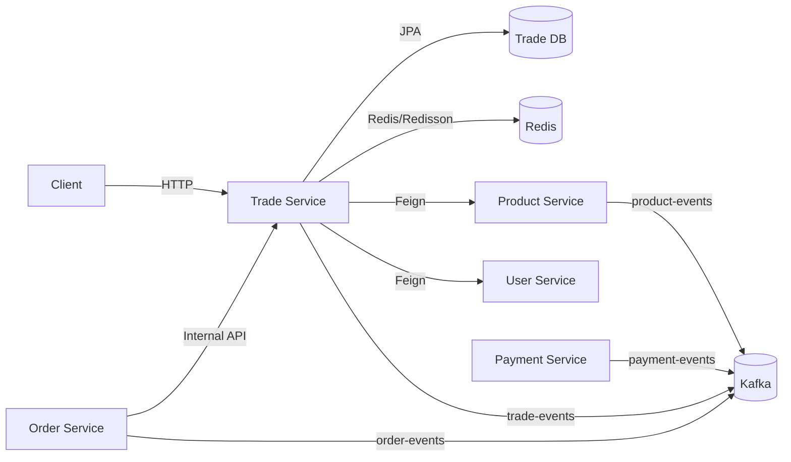
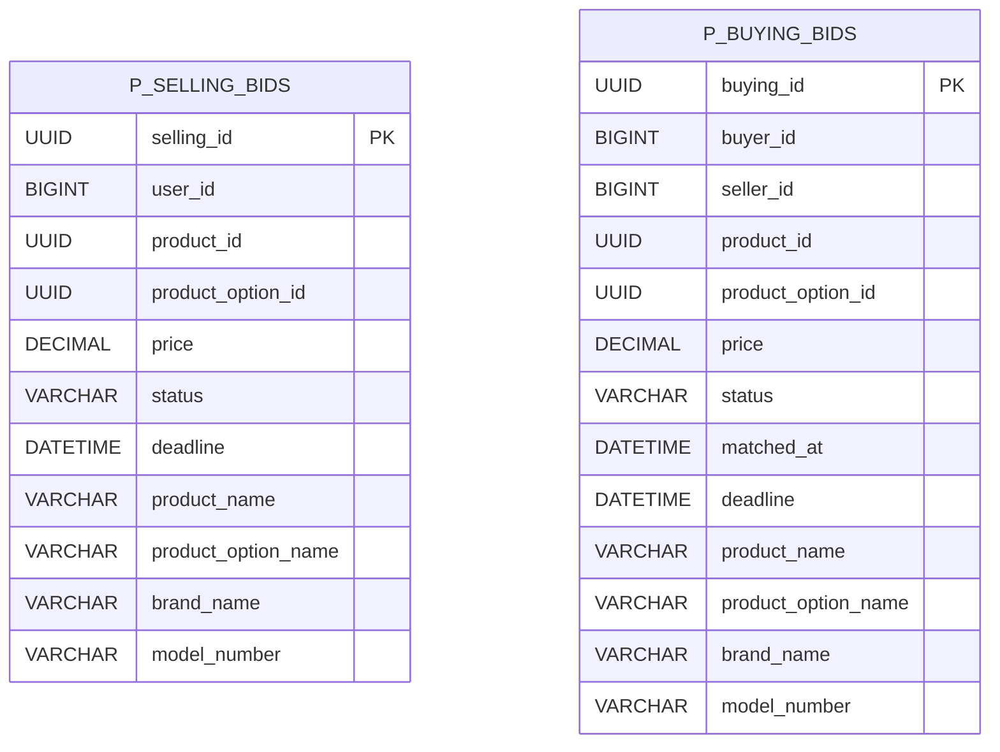
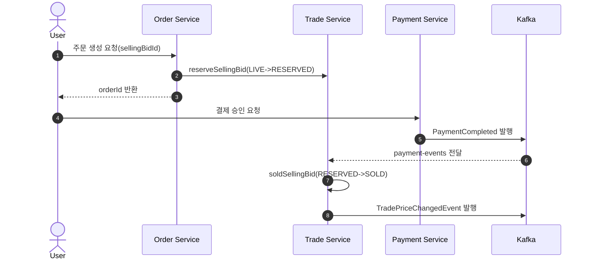
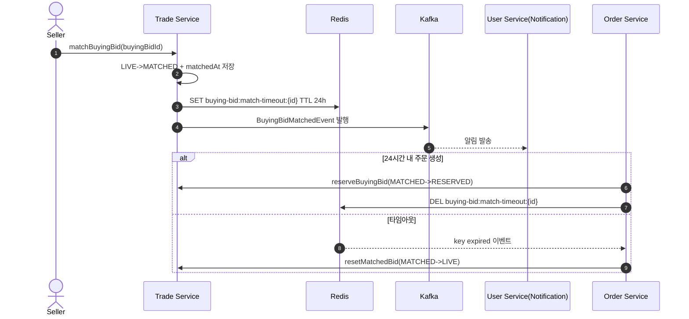
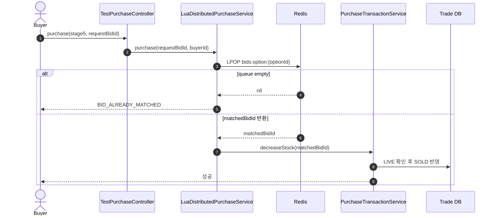

# Trade Service Deep Dive

## 1. 왜 Trade Service를 분리했는가

### 이유

Trade Service는 "입찰 생성/수정/취소 + 선점 + 매칭 + 가격 신호 전파"를 담당하는 고동시성 경계를 독립시키기 위해 분리되었습니다.

- 같은 상품 옵션에 대해 다수 사용자가 동시에 경쟁하는 구간이라 락 전략과 상태 전이가 핵심입니다.
- Product(User-facing 조회)와 달리, Trade는 경쟁 제어와 상태 정합성이 우선인 Write-critical 도메인입니다.
- Order/Payment와의 연동은 많지만, 입찰 자체 상태 머신은 Trade가 단일 소유권을 가져야 합니다.
- Redis 큐/Lua/분산락 같은 실험적 전략을 다른 서비스 영향 없이 고도화할 수 있습니다.

### 역할

- 판매입찰(`SellingBid`) 생성/수정/취소/조회
- 구매입찰(`BuyingBid`) 생성/수정/취소/조회/매칭
- 내부 API를 통한 입찰 선점/완료/복구/만료 처리
- 옵션 단위 최저가/최고가 계산 및 캐시 제공
- 가격 변경/매칭 이벤트를 Kafka로 발행
- 결제/주문/상품 이벤트를 수신해 상태 반영

### 비책임

- 사용자 인증 원천 소유
- 주문 상태 머신 소유
- 결제 승인/PG 통신 소유
- 카탈로그 원본 소유

---

## 2. 서비스 접근 URL

### URL

- Trade Swagger (dev): `https://dev.un-box.click/trade/swagger-ui/index.html`
- Trade Swagger (local): `http://localhost:8080/trade/swagger-ui/index.html`
- Trade API Base (dev): `https://dev.un-box.click/trade`
- Grafana (dev): `https://grafana.dev.un-box.click/`

### 참고

- `application.yml` 기준 컨텍스트 경로는 `/trade`
- Security 설정에서 ALB prefix 경로 Swagger(`/trade/**`)도 permit 처리

---

## 3. 아키텍처 개요

### 구조

- Presentation: Public/Admin/Internal/Test Controller
- Application: 입찰 유즈케이스 서비스 + 이벤트 핸들러 + 동시성 전략
- Domain: `SellingBid`, `BuyingBid`, Repository
- Infrastructure: RedisTemplate/Redisson, Kafka, Feign, Spring Cache

### 패키지

- `trade/application/service`
  - `SellingBidServiceImpl`
  - `BuyingBidService`
  - `BuyingBidInternalService`
  - `AdminSellingBidServiceImpl`, `AdminBuyingBidServiceImpl`
- `trade/application/service/purchase`
  - `PessimisticPurchaseService`
  - `DistributedPurchaseService`
  - `DistributedNextBestPurchaseService`
  - `CachedDistributedPurchaseService`
  - `LuaDistributedPurchaseService`
- `trade/application/event`
  - `PaymentEventListener`, `OrderEventListener`, `ProductEventListener`
  - `TradeEventProducer`
- `trade/domain`
  - `entity`: `SellingBid`, `BuyingBid`, `SellingStatus`, `BuyingStatus`
  - `repository`: `SellingBidRepository`, `BuyingBidRepository`

### 런타임

---

## 4. Spring Boot 사용 방식

### 기술 매핑

| 영역            | 사용 기술                                | 적용 위치                                | 사용 목적                 |
| :-------------- | :--------------------------------------- | :--------------------------------------- | :------------------------ |
| Web             | Spring MVC                               | `*Controller`                            | Public/Internal/Admin API |
| Security        | Spring Security + JWT Filter             | `SecurityConfig`                         | 무상태 인증/인가          |
| Method Security | `@EnableMethodSecurity`, `@PreAuthorize` | Admin Controller                         | 관리자 권한 제어          |
| Persistence     | Spring Data JPA                          | `*Repository`, `*Entity`                 | 입찰 영속성               |
| Cache           | Spring Cache + Redis                     | `@Cacheable`, `CacheManager`             | 가격/주문조회 캐시        |
| Lock            | Redisson + AOP                           | `@DistributedLock`, `DistributedLockAop` | 선점 경쟁 제어            |
| Messaging       | Spring Kafka                             | `*EventListener`, `TradeEventProducer`   | 상태 전파/수신            |
| Service Call    | OpenFeign                                | `ProductClient`, `UserClient`            | 옵션/사용자 검증          |
| Observability   | Actuator + Micrometer + OTel             | `application.yml`                        | 지표/트레이싱             |

### 설정 특징

- `server.servlet.context-path: /trade`
- Kafka consumer: `group-id=trade-group`, `enable-auto-commit=false`, `StringDeserializer`
- Caching: `@EnableCaching` 활성화
- Feign: default `connectTimeout=1000ms`, `readTimeout=3000ms`, 일부 client는 5000ms
- `FeignConfig`로 들어온 `Authorization` 헤더를 내부 Feign 요청으로 전달
- `CacheWarmingRunner`가 서버 시작 시 LIVE 판매입찰을 Redis 큐(`bids:option:*`)로 적재

---

## 5. API 계약

### Public API

#### 판매입찰

- `POST /trade/api/bids/selling`
- `DELETE /trade/api/bids/selling/{sellingId}`
- `PATCH /trade/api/bids/selling/{sellingId}/price`
- `GET /trade/api/bids/selling/{sellingId}`
- `GET /trade/api/bids/selling/my`

#### 구매입찰

- `POST /trade/api/bids/buying`
- `DELETE /trade/api/bids/buying/{buyingBidId}`
- `PATCH /trade/api/bids/buying/{buyingBidId}/price`
- `GET /trade/api/bids/buying/{buyingBidId}`
- `GET /trade/api/bids/buying/my`
- `POST /trade/api/bids/buying/{buyingBidId}/match`

#### 관리자

- `GET /trade/api/admin/bids/selling`
- `DELETE /trade/api/admin/bids/selling/{sellingId}`
- `GET /trade/api/admin/bids/buying`
- `DELETE /trade/api/admin/bids/buying/{buyingBidId}`

#### 동시성 테스트

- `POST /trade/api/trade/purchase/test?sellingBidId=...&buyerId=...&stage=stage1~stage5`
- `POST /trade/api/trade/purchase/test/warm-up/{optionId}`

### Internal API

#### Selling Internal

- `GET /trade/internal/bids/selling/{id}/for-cart`
- `GET /trade/internal/bids/selling/{id}/for-order`
- `POST /trade/internal/bids/selling/{id}/reserve`
- `POST /trade/internal/bids/selling/{id}/sold`
- `POST /trade/internal/bids/selling/{id}/live`
- `GET /trade/internal/bids/selling/product-option/{productOptionId}/lowest-price`
- `POST /trade/internal/bids/selling/product-options/lowest-prices`

#### Buying Internal

- `GET /trade/internal/bids/buying/{buyingBidId}/order-info`
- `POST /trade/internal/bids/buying/{buyingBidId}/reserve`
- `POST /trade/internal/bids/buying/{buyingBidId}/sold`
- `POST /trade/internal/bids/buying/{buyingBidId}/expire`
- `POST /trade/internal/bids/buying/{buyingBidId}/live`
- `GET /trade/internal/bids/buying/product-option/{productOptionId}/highest-price`
- `POST /trade/internal/bids/buying/product-options/highest-price`
- `POST /trade/internal/bids/buying/{buyingBidId}/reset-match`

### 보안 정책

- Swagger/Actuator: permitAll
- `/internal/**`: permitAll
- `/api/trade/purchase/**`(동시성 테스트): permitAll
- `/api/admin/**`: filter chain에서 `ROLE_MASTER`, `ROLE_MANAGER`만 허용
- 그 외 API: 인증 필요

---

## 6. 도메인 모델과 ERD

### 이유

Trade는 외부 서비스 FK 결합을 최소화하고, 입찰 시점 스냅샷을 저장해 이력 해석 안정성을 확보하는 모델을 사용합니다.

### 엔티티

- `p_selling_bids`
  - 판매자/상품/옵션 ID + 상품 스냅샷 + 가격/상태/마감일
  - 핵심 인덱스: `(product_option_id, status, price)`
- `p_buying_bids`
  - 구매자/판매자/상품/옵션 ID + 스냅샷 + 가격/상태/매칭시각

### 상태

- `SellingStatus`: `LIVE`, `RESERVED`, `SOLD`, `CANCELLED`
- `BuyingStatus`: `LIVE`, `MATCHED`, `RESERVED`, `SOLD`, `CANCELLED`, `EXPIRED`

### 전이 규칙(핵심)

- Selling:
  - `LIVE -> RESERVED -> SOLD`
  - `LIVE -> CANCELLED`(사용자 취소)
  - `RESERVED/SOLD -> LIVE`(결제실패/환불 복구)
  - `RESERVED -> CANCELLED`(만료/정책 취소)
- Buying:
  - `LIVE -> MATCHED`(판매자 수락)
  - `MATCHED -> RESERVED -> SOLD`
  - `MATCHED -> LIVE`(타임아웃 리셋)
  - `LIVE -> CANCELLED`(사용자 취소)
  - `RESERVED/SOLD -> LIVE`(결제실패/환불 복구)

### ERD

### 모델 특징

- 두 테이블 모두 soft delete(`deleted_at`) 기반
- 타 서비스 FK 대신 ID 참조 + 스냅샷 저장
- 상태 변경은 엔티티 메서드와 서비스 가드로 이중 검증

---

## 7. 캐시/통신/이벤트 설계

### 이유

Trade는 읽기 성능(가격/입찰 조회)과 쓰기 정합성(선점/상태전이)을 동시에 맞춰야 하므로 Cache + Event + Transaction Hook를 함께 사용합니다.

### Redis 키

- `bids:option:{optionId}`: 옵션별 LIVE 판매입찰 큐(가격 오름차순)
- `bid:option:{bidId}`: bid -> option 매핑 캐시(TTL 1h, stage4/5)
- `option:soldout:{optionId}`: 품절 게이트 캐시(TTL 10m)
- `buying-bid:match-timeout:{buyingBidId}`: 구매입찰 매칭 타임아웃(24h)

### Spring Cache

- `trade:price:lowest`: 옵션별 최저가
- `trade:price:highest`: 옵션별 최고가
- `trade:bid:order`: 주문용 판매입찰 조회
- `trade:bid:buying`: 주문용 구매입찰 조회

### 동기 통신

- `ProductClient`
  - 판매입찰/구매입찰 생성 시 옵션 스냅샷 조회
- `UserClient`
  - 판매입찰 생성 시 판매자 유효성 검증
- Feign 보조
  - `FeignConfig`가 `Authorization` 헤더 전달

### 비동기 통신

#### Producer (`trade-events`)

- `TradePriceChangedEvent`
- `BuyingBidMatchedEvent`

#### Consumer

- `payment-events`
  - `PaymentCompleted` -> 입찰 `SOLD`
  - `PaymentFailed` -> 입찰 `LIVE` 복구
- `order-events`
  - `OrderCancelled`, `OrderExpired`, `OrderRefundRequested`, `OrderShipmentExpired`
  - 주문 이벤트에 따라 `LIVE/CANCELLED/SOLD` 복구/변경
- `product-events`
  - Brand/Product/Option 삭제 이벤트 수신 시 연관 입찰 soft-delete 처리

### 정합성 패턴

- `TransactionSynchronization.afterCommit`로 이벤트 발행 시점 고정
- 상태가 이미 터미널이면 스킵하는 멱등 가드 다수 적용
- Kafka listener는 수동 ack 정책 사용

---

## 8. 동시성 제어 (stage1~stage5)

### 전략 요약

| Stage  | 구현체                               | 제어 방식                           | 장점                         | 한계                             |
| :----- | :----------------------------------- | :---------------------------------- | :--------------------------- | :------------------------------- |
| stage1 | `PessimisticPurchaseService`         | DB 비관적 락(`FOR UPDATE`)          | 구현 단순, 강한 일관성       | DB 락 대기 증가                  |
| stage2 | `DistributedPurchaseService`         | Bid 단위 Redisson 락(Fail-fast)     | DB 락 경합 분산              | 단일 bid 기준이라 차선 매칭 없음 |
| stage3 | `DistributedNextBestPurchaseService` | Option 단위 락 + 최저 LIVE 재조회   | 차선 매칭 가능               | 락 범위가 넓어 대기 증가 가능    |
| stage4 | `CachedDistributedPurchaseService`   | Sold-out 캐시 + Option 락 + DB 확인 | DB 접근 절감, 품절 빠른 차단 | 캐시 정확도/만료 전략 관리 필요  |
| stage5 | `LuaDistributedPurchaseService`      | Redis `LPOP` 원자 선점 + DB 반영    | 락 없이 초저지연             | DB 실패 시 큐 보상 정책 필요     |

### 공통 트랜잭션

- `PurchaseTransactionService#decreaseStock`는 `REQUIRES_NEW`
- 최종 반영 직전에 `LIVE` 상태를 재검증하고 `SOLD`로 전이

### 전략 선택 기준

- 정확성 최우선/트래픽 낮음: stage1
- 분산 환경 기본형: stage2
- 동일 옵션 경쟁 높고 차선 매칭 필요: stage3
- 핫옵션 품절 구간 최적화: stage4
- 대량 동접 초저지연 실험: stage5

---

## 9. 핵심 시퀀스

### 판매입찰 주문-결제 완료

### 구매입찰 매칭 + 타임아웃 복구

### Stage5 Lua 큐 기반 선점

---

## 10. 디자인 패턴과 적용 이유

### 패턴

| 패턴                   | 코드 위치                                     | 적용 이유                       |
| :--------------------- | :-------------------------------------------- | :------------------------------ |
| Strategy Pattern       | `purchase/*PurchaseService`                   | stage별 동시성 전략 교체/실험   |
| Proxy Pattern          | `@FeignClient`, Spring Security Filter        | 외부 호출/보안 경계 캡슐화      |
| Decorator(AOP) Pattern | `@DistributedLock` + `DistributedLockAop`     | 비즈니스 로직 오염 없이 락 부여 |
| Repository Pattern     | `SellingBidRepository`, `BuyingBidRepository` | 도메인과 영속성 분리            |
| Observer Pattern       | Kafka Producer/Listener                       | 서비스 간 느슨한 결합           |
| Cache-Aside Pattern    | `@Cacheable` + 명시적 evict                   | 읽기 성능 향상                  |
| After-Commit Hook      | `TransactionSynchronization`                  | 커밋 후 이벤트 발행 정합성      |
| Snapshot Pattern       | 입찰 내 상품/옵션/브랜드 이름 저장            | 타 서비스 변경에도 이력 안정성  |
| Idempotency Guard      | SOLD/CANCELLED 상태 스킵 로직                 | 재시도/중복 이벤트 안정성       |
| Builder Pattern        | Entity/DTO Builder                            | 생성 인자 가독성 및 안전성      |

---

## 11. CS 관점

### 핵심

- Lock Granularity
  - bid 단위 락은 충돌 범위가 작고,
  - option 단위 락은 차선 매칭 정확도가 높습니다.
- Fail-fast vs Wait
  - stage2/4는 fail-fast로 응답성을 우선하고,
  - stage3는 대기를 허용해 성공률을 높입니다.
- 상태 전이 정합성
  - 단순 CRUD가 아니라 상태 머신으로 봐야 하며,
  - 전이 가드가 재처리 안정성의 핵심입니다.
- Eventual Consistency
  - 결제/주문/상품 이벤트는 비동기 반영이므로 일시적 불일치를 허용합니다.
- Cache Coherency
  - 캐시 무효화와 이벤트 발행 순서가 잘못되면 stale read가 생기므로 afterCommit 패턴이 중요합니다.
- Hot Key/Queue 문제
  - 인기 옵션은 `bids:option:{optionId}`가 집중될 수 있어 키 분산/메트릭 관측이 필요합니다.

---

## 12. 보완해야 할 사항 (우선순위)

### P0

1. Product 이벤트 소비 타입 정합성 점검

- 현재 Trade consumer는 `StringDeserializer` 설정인데, `ProductEventListener`는 `ConsumerRecord<String, Object>` + `instanceof` 분기를 사용합니다.
- 실제 런타임 역직렬화 타입과 분기 로직이 불일치하면 상품 삭제 이벤트가 무시될 수 있습니다.

2. 상품 삭제 시 BuyingBid 정리 경로 누락

- `ProductEventListener`는 현재 `AdminSellingBidService`만 호출해 판매입찰만 정리합니다.
- 구매입찰(`AdminBuyingBidService`) 정리가 빠지면 삭제된 옵션에 LIVE 구매입찰이 남을 수 있습니다.

3. 내부/테스트 API 접근 제어 강화

- `/internal/**`, `/api/trade/purchase/**`가 permitAll입니다.
- 게이트웨이/네트워크 ACL 없이 직접 노출되면 공격면이 커집니다.

### P1

1. 관리자 권한 정책 일관성

- `SecurityConfig`는 `/api/admin/**`를 `MASTER/MANAGER`만 허용합니다.
- 일부 컨트롤러는 `@PreAuthorize`에서 `INSPECTOR` 조회 권한을 명시해 정책이 충돌합니다.

2. 가격 이벤트 의미 분리

- `BuyingBidService`에 `TradePriceChangedEvent`를 최고가에도 재사용하는 TODO가 남아 있습니다.
- 하위 소비자가 "최저가 이벤트"로 가정하면 해석 충돌 위험이 있습니다.

3. Stage5 실패 보상

- Lua `LPOP` 후 DB 반영 실패 시 큐 재적재/보상 트랜잭션이 없습니다.
- 고가용성 환경에서 일시 장애 시 유실처럼 보이는 케이스를 만들 수 있습니다.

4. 큐 재구성 비용 최적화

- `addBidToRedisQueue`는 변경마다 옵션 큐를 삭제 후 전체 rebuild합니다.
- 핫옵션/대량 입찰에서는 Redis/DB 모두에 비용이 큽니다.

5. 이벤트 중복 처리 고도화

- 현재는 상태 가드 중심 멱등성입니다.
- 이벤트 ID 저장 기반 dedupe를 추가하면 재처리 안정성이 더 높아집니다.

### P2

1. 상태 머신 명시화

- 전이 규칙이 서비스/리스너에 분산되어 있어 정책 변경 시 영향 파악 비용이 큽니다.

2. 동시성/큐 지표 강화

- stage별 처리량, 락 획득 실패율, 큐 길이, 상태전이 실패율 메트릭이 필요합니다.

3. 동시성 테스트 API 운영 분리

- 테스트 컨트롤러는 유용하지만 운영 프로파일에서 비활성화 또는 별도 서비스 분리가 안전합니다.

---

## 13. 운영 체크리스트

### 체크 항목

- Swagger: `https://dev.un-box.click/trade/swagger-ui/index.html`
- Grafana: `https://grafana.dev.un-box.click/`
- Kafka:
  - `trade-events` publish 실패율
  - `payment-events`, `order-events`, `product-events` consumer lag
- Redis:
  - `bids:option:*` 큐 길이 분포
  - `option:soldout:*` 키 개수/만료 패턴
  - `buying-bid:match-timeout:*` 만료 처리량
- API 오류:
  - `INVALID_ORDER_STATUS`, `BID_ALREADY_MATCHED` 비율
  - `LockAcquisitionFailedException` 발생 추이
- 성능:
  - stage별 구매 처리 지연(p95/p99)
  - Feign(Product/User) 지연 및 오류율
