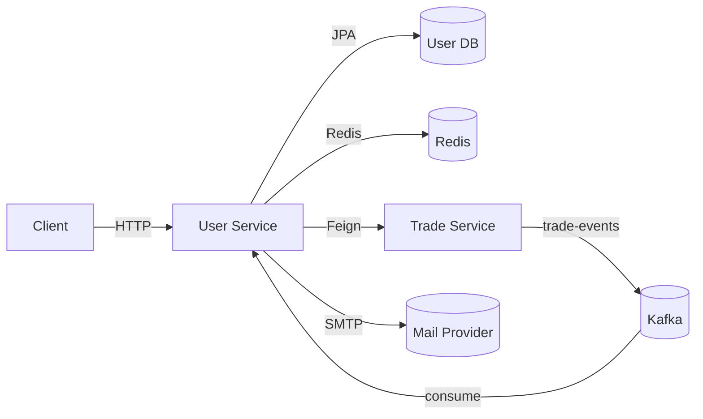
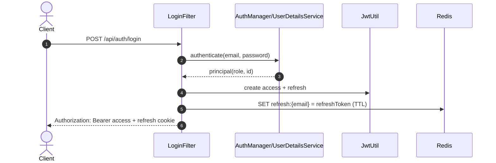
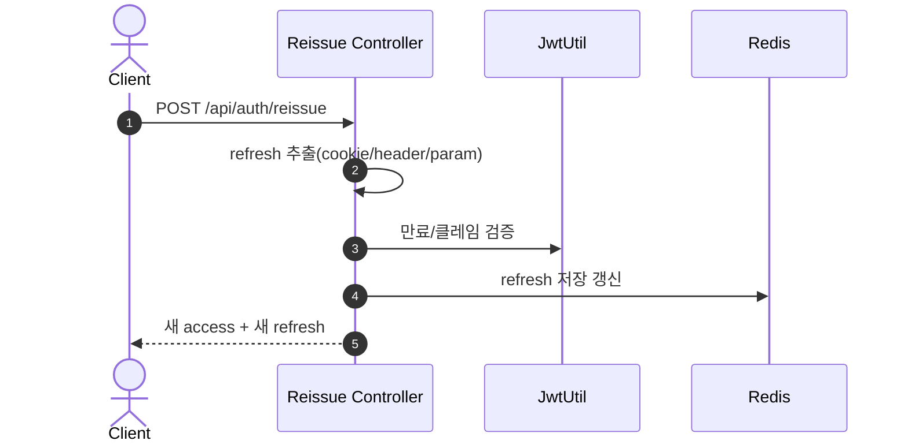
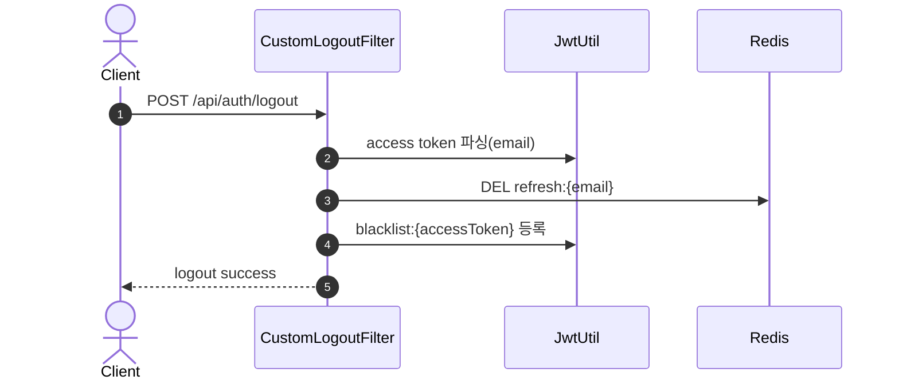
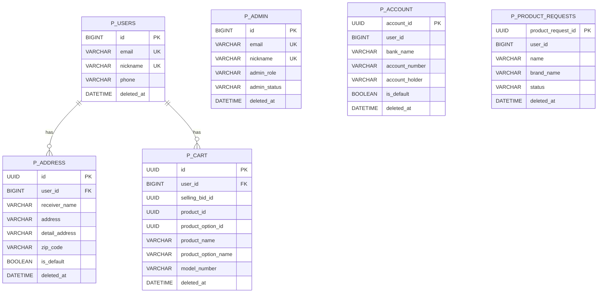
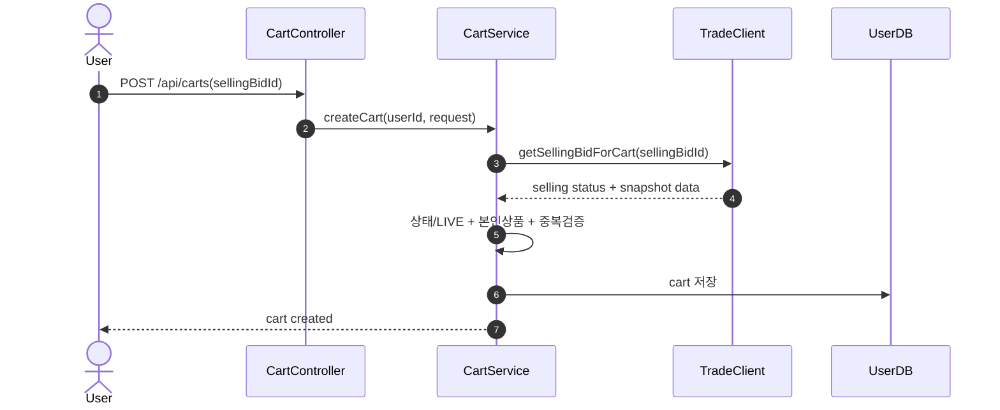
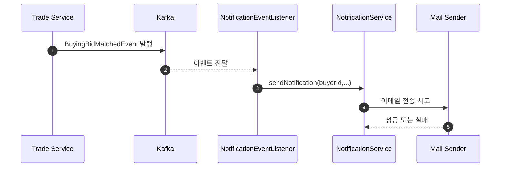

# User Service Deep Dive

## 1. 왜 User Service를 분리했는가

### 이유

User Service는 "인증/인가 + 사용자 정체성 + 사용자 자산(프로필/주소/계좌/장바구니)"을 한 경계 안에서 관리하기 위해 분리되었습니다.

- 인증은 거래/결제보다 보안 변경 주기가 빠르고 장애 영향도가 큼
- 사용자 원천 데이터(이메일, 닉네임, 권한)는 모든 서비스가 참조하므로 단일 소유자가 필요
- 인증 장애와 거래 장애를 분리해 Blast Radius를 최소화해야 함
- User/Admin 권한 모델과 운영 정책은 주문/결제 도메인과 독립적으로 발전해야 함

### 역할

- JWT 기반 로그인/로그아웃/재발급
- 사용자/관리자 계정 관리
- 사용자 배송지/정산 계좌 관리
- 장바구니 관리
- 상품 요청(Product Request) 접수 및 관리자 처리
- Trade 이벤트 기반 사용자 알림(이메일)
- 다른 서비스가 호출하는 내부 사용자 정보 API 제공

### 비책임

- 상품 카탈로그 소유권
- 입찰 매칭/가격 소유권
- 주문 상태 머신
- 결제 승인/환불/정산 확정

---

## 2. 서비스 접근 URL

### URL

- User Swagger (dev): `https://dev.un-box.click/user/swagger-ui/index.html`
- User Swagger (local): `http://localhost:8080/user/swagger-ui/index.html`
- User API Base (dev): `https://dev.un-box.click/user`
- Grafana (dev): `https://grafana.dev.un-box.click/`

### 참고

- `application.yml` 기준 컨텍스트 경로는 `/user`
- 실제 엔드포인트는 `/{context-path}` + 컨트롤러 매핑으로 구성됨

---

## 3. 아키텍처 개요

### 구조

- Presentation: Controller + OpenAPI Interface
- Application: 유즈케이스 단위 Service
- Domain: Entity + Repository
- Infrastructure: Security Filter Chain, Redis, Kafka Consumer, Feign Client, Mail Sender

### 패키지

- `auth`: 인증 진입점, 재발급, 테스트 부트스트랩
- `common/security`: 로그인/로그아웃 필터, 사용자 로드, 리프레시 토큰 저장소
- `user`: 사용자 정보, 주소/계좌, 내부 API
- `admin`: 관리자 스태프 도메인
- `cart`: 장바구니 도메인
- `request`: 상품 요청 도메인
- `notification`: 이벤트 소비/메일 알림

### 런타임

---

## 4. Spring Boot 사용 방식

### 기술 매핑

| 영역               | 사용 기술                    | 적용 위치                                    | 사용 목적                |
| :----------------- | :--------------------------- | :------------------------------------------- | :----------------------- |
| Web                | Spring MVC                   | `*Controller`                                | REST API 노출            |
| Validation         | Jakarta Validation           | Request DTO                                  | 입력 검증                |
| Security           | Spring Security              | `SecurityConfig`, `LoginFilter`, `JwtFilter` | 인증/인가                |
| Persistence        | Spring Data JPA              | `*Repository`, `*Entity`                     | 영속성                   |
| Redis              | Spring Data Redis            | `RefreshTokenRedisRepository`, `JwtUtil`     | 리프레시 토큰/블랙리스트 |
| Messaging          | Spring Kafka                 | `NotificationEventListener`                  | 비동기 이벤트 소비       |
| Service-to-service | OpenFeign                    | `TradeClient`                                | 내부 API 동기 호출       |
| Mail               | JavaMailSender               | `NotificationService`                        | 이메일 알림              |
| Docs               | springdoc-openapi            | Swagger UI                                   | API 문서                 |
| Observability      | Actuator + Micrometer + OTel | `application.yml`                            | 메트릭/트레이싱          |

### 설정 특징

- `server.servlet.context-path: /user`
- JWT 만료: Access 1시간, Refresh 60시간
- Kafka consumer: `enable-auto-commit: false`, `ack-mode: manual`
- Redis key prefix: `refresh:`, `blacklist:`

---

## 5. API 계약

### Public API

#### 인증

- `POST /user/api/auth/signup`
- `POST /user/api/auth/login`
- `POST /user/api/auth/logout`
- `POST /user/api/auth/reissue`
- `POST /user/api/admin/auth/signup`
- `POST /user/api/admin/auth/login`
- `POST /user/api/admin/auth/logout`
- `POST /user/api/admin/auth/reissue`

#### 사용자

- `GET /user/api/users/me`
- `PATCH /user/api/users/me`
- `DELETE /user/api/users/me`

#### 주소/계좌

- `POST /user/users/me/addresses`
- `GET /user/users/me/addresses`
- `DELETE /user/users/me/addresses/{addressId}`
- `POST /user/users/me/accounts`
- `GET /user/users/me/accounts`
- `DELETE /user/users/me/accounts/{accountId}`

#### 장바구니

- `POST /user/api/carts`
- `GET /user/api/carts`
- `DELETE /user/api/carts/{id}`
- `DELETE /user/api/carts`

#### 상품 요청

- `POST /user/api/products/requests`
- `GET /user/api/admin/product-requests`
- `PATCH /user/api/admin/product-requests/{productRequestId}/status`

#### 관리자

- `GET /user/api/admin/staff`
- `GET /user/api/admin/staff/managers`
- `GET /user/api/admin/staff/inspectors`
- `GET /user/api/admin/staff/{adminId}`
- `PATCH /user/api/admin/staff/{adminId}`
- `DELETE /user/api/admin/staff/{adminId}`
- `GET /user/api/admin/users`
- `PATCH /user/api/admin/users/{userId}`
- `DELETE /user/api/admin/users/{userId}`

### Internal API

- `GET /user/internal/users/{userId}/for-selling-bid`
- `GET /user/internal/users/{userId}/for-order`
- `GET /user/internal/users/{userId}/has-default-account`

### 경계 규칙

- 로그인 실제 처리는 Controller가 아니라 `LoginFilter`가 수행
- 내부 API는 최소 필드 계약만 반환해 결합도를 낮춤

---

## 6. 인증/인가 상세

### 인증 파이프라인

1. `LoginFilter`가 `/api/auth/login`, `/api/admin/auth/login` 요청을 처리
2. `AuthenticationManager` + `CustomUserDetailsService`로 사용자 검증
3. Access/Refresh JWT 발급
4. `refresh:{email}` 키로 Redis 저장
5. Access는 `Authorization` 헤더, Refresh는 HttpOnly Cookie로 전달
6. 이후 요청에서 `JwtFilter`가 만료/블랙리스트/클레임 검증
7. SecurityContext에 `CustomUserDetails` 주입

### 권한 모델

- 사용자: `ROLE_USER`
- 관리자: `ROLE_MASTER`, `ROLE_MANAGER`, `ROLE_INSPECTOR`
- URL 규칙 + 서비스 메서드 `@PreAuthorize` 혼합 적용

### Redis 키 설계

- `refresh:{email}`
- 용도: 현재 유효한 Refresh Token 저장
- TTL: `REFRESH_TOKEN_EXPIRE_MS` (60시간)
- `blacklist:{accessToken}`
- 용도: 로그아웃된 Access Token 강제 무효화
- TTL: Access 만료시간 기준

### 토큰 라이프사이클 시퀀스

---

## 7. 도메인 모델과 ERD

### 엔티티

- `p_users`: 사용자 기본 정보
- `p_admin`: 관리자 계정/역할/상태
- `p_address`: 사용자 배송지 (`ManyToOne -> User`)
- `p_account`: 정산 계좌 (`user_id` 값 참조)
- `p_cart`: 판매입찰 참조 + 상품 스냅샷
- `p_product_requests`: 사용자 상품 요청

### 공통 규칙

- 대부분 `BaseEntity` 상속 (`created_at`, `updated_at`, `deleted_at` 등)
- 대부분 `@SQLRestriction("deleted_at IS NULL")`로 soft-delete 기본 필터링
- ID 타입 혼합: `Long`(User/Admin), `UUID`(Address/Account/Cart/ProductRequest)

### ERD

### 불변 조건

- 주소 등록: 첫 주소 자동 기본값, 기본 주소 신규 등록 시 기존 기본값 해제
- 계좌 등록: 첫 계좌 자동 기본값, 기본 계좌 신규 등록 시 기존 기본값 해제
- 장바구니: 본인 판매입찰 등록 불가, LIVE 상태만 등록 가능, 동일 판매입찰 중복 불가

---

## 8. 서비스 간 통신과 일관성

### 동기 통신

- 대상: Trade Service
- 클라이언트: `TradeClient`
- 호출: `/trade/internal/bids/selling/{id}/for-cart`
- 목적: 장바구니 생성/조회 시 판매입찰 상태/가격 확인

### 비동기 통신

- 토픽: `trade-events`
- 이벤트: `BuyingBidMatchedEvent`
- 소비자: `NotificationEventListener`
- 목적: 구매입찰 매칭 시 사용자 알림 전송

### 일관성 모델

- 인증/인가: 요청 시점 강한 일관성(토큰 만료/블랙리스트 즉시 검증)
- 장바구니: Trade 내부 상태를 동기 조회해 정합성 검증
- 알림: Eventual Consistency 허용(실패 시 비즈니스 트랜잭션과 분리)

### 시퀀스: 장바구니 등록

### 시퀀스: 매칭 알림

---

## 9. 디자인 패턴과 적용 이유

### 패턴

| 패턴                | 코드 위치                                                                     | 적용 이유                                  |
| :------------------ | :---------------------------------------------------------------------------- | :----------------------------------------- |
| Proxy Pattern       | `@FeignClient`, Security Filter Chain                                         | 외부 호출/보안 처리의 경계 캡슐화          |
| Builder Pattern     | `Cart`, `Account`, DTO Builder                                                | 생성 인자 증가에 대한 가독성 확보          |
| Factory Method      | `User.createUser`, `Admin.createAdmin`, `ProductRequest.createProductRequest` | 생성 규칙/검증을 단일 진입점으로 통일      |
| Repository Pattern  | `*Repository`                                                                 | 도메인 로직과 영속성 분리                  |
| Observer Pattern    | `@KafkaListener`                                                              | 거래 이벤트와 알림 도메인 느슨한 결합      |
| Soft Delete Pattern | `BaseEntity#softDelete` + `@SQLRestriction`                                   | 삭제 이력 보존 및 운영 복구 여지 확보      |
| Snapshot Pattern    | `Cart`의 상품 필드                                                            | 타 서비스 데이터 변경에도 조회 안정성 유지 |
| Guard Clause        | 서비스 내 빠른 예외 반환                                                      | 실패 케이스를 앞에서 차단해 흐름 단순화    |

---

## 10. CS 관점

### 핵심

- Stateless JWT: 서버 세션 제거로 수평 확장에 유리
- Token Revocation: JWT 즉시 폐기 불가 문제를 Redis 블랙리스트로 보완
- Bounded Context: User가 정체성 원천 데이터 소유, Trade/Order는 내부 API로 소비
- Sync + Async Hybrid: 검증은 동기, 알림은 비동기로 분리해 응답시간과 신뢰성 균형 확보
- Soft Delete 중심 모델: 감사 추적과 운영 복구에 유리
- Snapshot Read Model: 장바구니 조회 성능과 내결함성 확보

---

## 11. 보완해야 할 사항 (우선순위)

### P0

1. Method Security 활성화 확인 필요

- `@PreAuthorize`가 다수 존재하나 `@EnableMethodSecurity` 설정이 User 서비스에서 확인되지 않음
- 의도한 서비스 메서드 권한 검사가 실제로 동작하는지 즉시 검증 필요

2. 관리자 로그아웃 경로 정합성

- Security 규칙은 `/api/admin/auth/logout`을 허용하지만 `CustomLogoutFilter`는 `/api/auth/logout`만 처리
- 관리자 로그아웃이 동일 정책으로 무효화되는지 점검 필요

3. 로그아웃 블랙리스트 TTL 계산 검증

- 로그아웃 필터의 `expirationMillis = 60 * 60 * 24L`는 밀리초 기준 약 86.4초
- Access 만료(1시간) 대비 너무 짧아 재사용 위험 가능

### P1

1. 재발급 검증 정책 통일

- 관리자 재발급은 Redis 토큰 일치 검증을 수행
- 사용자 재발급은 동일 검증이 상대적으로 약함
- 사용자/관리자 동일한 재발급 보안 규칙으로 통일 권장

2. 관리자 재발급 토큰 생성 경로 점검

- 관리자 재발급에서 user claim/토큰 생성 메서드 사용 코드가 보여 정책 정합성 점검 필요

3. Kafka 수동 커밋 설정 점검

- 설정은 `ack-mode: manual`이나 Listener에서 `Acknowledgment` 사용 코드가 없음
- 오프셋 커밋 정책 의도와 실제 동작 일치 여부 점검 필요

4. 보안 로그 마스킹

- 토큰 전체 문자열이 로그에 남는 구간이 있어 민감정보 노출 위험
- 토큰/개인정보 로그 마스킹 정책 필요

### P2

1. API 경로 일관성

- 사용자 API 대부분은 `/api/*` 패턴
- 주소/계좌는 `/users/me/*` 패턴으로 분리되어 게이트웨이 정책 복잡도 증가

2. 환경 설정 안정화

- `ddl-auto: create`가 운영 환경에서 유지되면 위험
- 프로파일별 스키마 관리 전략(Flyway/Liquibase 등) 권장

3. 알림 채널 확장성

- 현재 이메일 중심, `JavaMailSender` 미설정 시 skip
- 큐잉/재시도/대체 채널(SMS/Push) 설계 여지 존재

---

## 12. 운영 체크리스트

### 체크 항목

- Swagger 접근 확인: `https://dev.un-box.click/user/swagger-ui/index.html`
- Grafana 대시보드 확인: `https://grafana.dev.un-box.click/`
- 인증 실패율: `401/403` 비율, 급증 시점
- Redis 키 모니터링: `refresh:*`, `blacklist:*` 개수/증가율/메모리
- Kafka 모니터링: `trade-events` consumer lag
- 재발급 API 비율/실패율 모니터링
- 관리자 API 감사 로그(변경/삭제) 추적
- Actuator `health`, `prometheus` 수집 상태 확인
